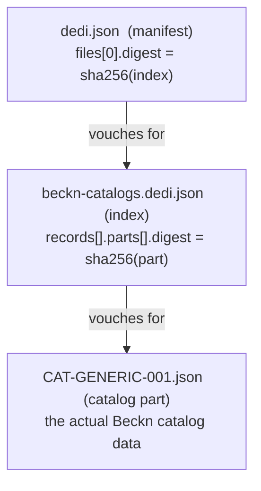
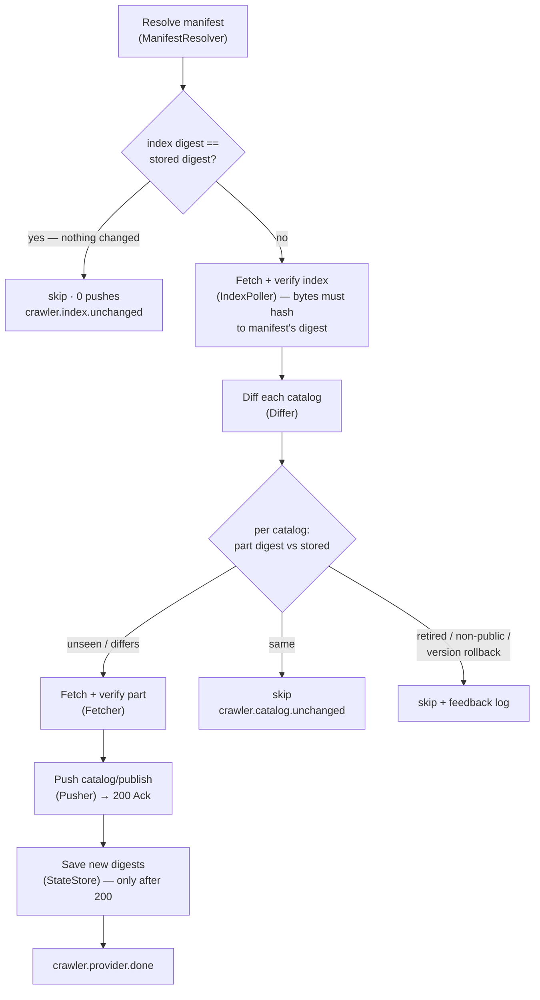

# Decentralized Catalog Crawler (POC)

A small Spring Boot worker that lets publishers share catalogs by **hosting files in a bucket**
instead of pushing to Discover directly. The crawler **polls** those buckets, detects what changed
using SHA-256 checksums, and syncs only the changes into Discover via `POST /beckn/catalog/push`.

> Decentralized: anyone can publish by hosting files — no per-publisher integration.
> For this POC the "bucket" is a public GitHub repo; in production it is a cloud object store (S3/GCS).

---

## 1. What's in the bucket — a chain of 3 files linked by checksums

A file **never carries its own checksum — its parent does.** The manifest vouches for the index,
the index vouches for each catalog. So one tiny digest tells the crawler whether *anything* changed.



| File | Role | Holds the digest of |
|------|------|---------------------|
| `dedi.json` | **manifest** — entry point (`/dedi.json`) | the index file |
| `beckn-catalogs.dedi.json` | **index** — one `record` per catalog | each catalog part |
| `CAT-GENERIC-001.json` | **catalog part** — Beckn catalog document | *(nothing — it's the leaf)* |

---

## 2. How one crawl pass works

Runs every `poll-interval` (e.g. `2m`). For each provider in config:



Discover Acks `200` synchronously, then asynchronously persists to Postgres and indexes to Elasticsearch.

---

## 3. Change detection — the three scenarios

Detection is purely **checksum comparison** — no content diffing, no timestamps.

| Scenario | What the crawler sees | Result |
|----------|----------------------|--------|
| **Fresh catalog** | part never seen before | fetch + verify + **push** |
| **Modified catalog** | index digest changed → part digest differs | fetch + verify + **push** (upsert) |
| **Unchanged catalog** | manifest's index digest matches stored | **skip — 0 pushes** (one tiny GET) |
| **New catalog added** | index digest changed (extra record); existing parts unchanged | push **only** the new catalog; existing ones skipped, not even downloaded |

To publish an update you edit the file, then refresh digests **up the chain**:
part → `parts[].digest` in index → recompute index → `files[].digest` in manifest.

---

## 4. Why it's safe & efficient

- **State only advances after a confirmed 200 Ack** — stored in two Postgres tables
  (`index_crawl_state`, `catalog_part_state`). A crash or failed push mid-pass is re-done next
  pass, never silently skipped.
- **Verify-before-trust** — every fetched file is hashed against the digest its parent promised
  before it's used. A mismatch is a hard reject (never ingest unverified bytes).
- **Rollback guard** — a catalog whose `version` goes *backwards* is rejected as tampering.
- **Cheap when idle** — an unchanged bucket costs one small manifest GET per poll.
- **Nothing hardcoded** — providers, endpoint, poll interval, timeouts, cache-bust are all config/env.

---

## 5. Components

| Component | Responsibility |
|-----------|----------------|
| `CrawlerProperties` | all settings, bound from `crawler.*` env |
| `CrawlerHttpClient` | JDK HTTP GET/POST; byte cap, timeout, optional cache-buster |
| `ManifestResolver` | derive `/dedi.json`, fetch it, expose provider name + index URL/digest |
| `IndexPoller` | fetch the index, verify its digest + publisher domain |
| `Differ` | pure decision per catalog: PUSH / SKIP_UNCHANGED / SKIP_NON_PUBLIC / SKIP_ROLLBACK / RETIRE |
| `Fetcher` | GET a catalog part and verify its digest |
| `Pusher` | wrap verified parts in a `catalog/publish` envelope, POST to `/beckn/catalog/push` |
| `StateStore` | the crawler's memory (2 Postgres tables); upsert only after 200 |
| `FeedbackLog` | append-only JSON audit of every skip/reject (the "why not ingested" trail) |
| `CrawlScheduler` | drives the cadence (fixed delay = `poll-interval`) |
| `Crawler` | orchestrates one pass over all providers |

---

## 6. Configuration (all env-driven)

| Env var | Meaning | Default |
|---------|---------|---------|
| `CRAWLER_PROVIDERS` | comma-separated bucket base URL(s) | *(required)* |
| `CRAWLER_WELL_KNOWN_PATH` | manifest path appended to each base | `/.well-known/dedi.json` |
| `CRAWLER_PUSH_ENDPOINT` | Discover ingestion endpoint | *(required)* |
| `CRAWLER_POLL_INTERVAL` | how often a pass runs | `2m` |
| `CRAWLER_HTTP_TIMEOUT` | per-request timeout | `30s` |
| `CRAWLER_MAX_PART_BYTES` | safety cap on a fetched part | `10485760` |
| `CRAWLER_HTTP_CACHE_BUST` | append `?cb=` to bypass a CDN edge cache (e.g. GitHub raw) | `true` |
| `CRAWLER_DB_URL/USERNAME/PASSWORD` | Postgres for the 2 state tables | *(required)* |

---

## 7. Run it

From the repo root (self-contained: Kafka, Postgres, Elasticsearch, ingestion, discover, dispatcher, crawler):

```bash
docker compose -f docker-compose.crawler-poc.yml up -d --build
docker logs -f crawler                    # watch the crawl lifecycle (structured JSON)
```

Verify what was ingested:
```bash
docker exec postgres psql -U catalog_user -d catalog_db -c \
  "select id, catalog_id from item;"
```

---

## Notes / non-goals (POC)

- **Signature verification is deferred** — sample data is `UNSIGNED_LOCAL_TEST_DATA`; auth is off.
- **GitHub raw is eventually-consistent** — a CDN edge cache (`max-age=300`, handled by the cache-buster)
  *plus* a short origin-propagation lag after each commit. A real object store has neither.
- The manifest/index/catalog are the minimal fields the POC reads; proof/keys/schema are ignored.
