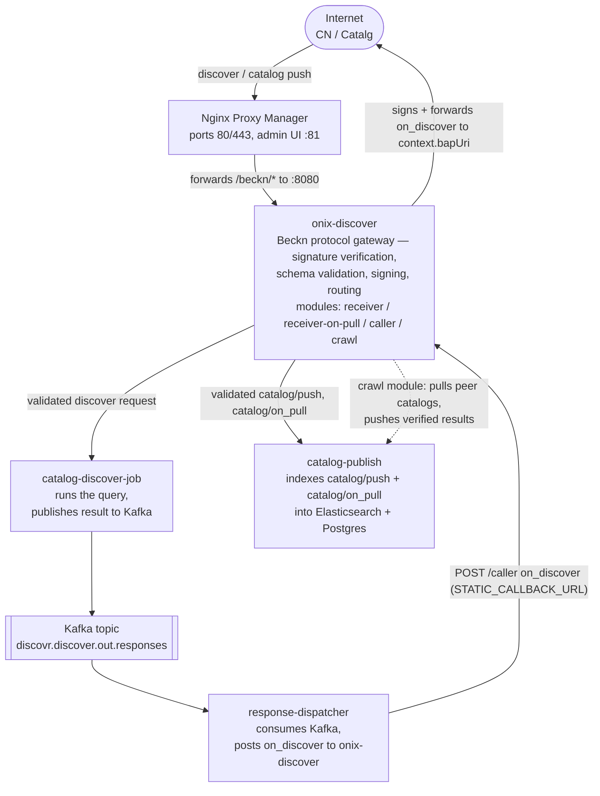

# Beckn Discovr — Deployment Guide

This document is for a DevOps engineer standing up the **Beckn Discovr** stack — a catalog
discovery service fronted by the **Onix adapter** — as a single docker-compose deployment on
a host. It's organized in three self-contained parts:

1. **Overview** (§1) — what Discovr does and how the pieces fit together.
2. **Deployment** (§2) — step-by-step tasks: prerequisites, first-time setup, upgrading,
   rollback, troubleshooting.
3. **Component & configuration reference** (§3) — every container, every setting in
   `discovr-stack.yml`, and every config block in `onix-discover/discover-adapter.yaml`.

All application images are published publicly on Docker Hub under the `fidedocker` org —
no registry authentication is required to pull them.

> Deploying to Kubernetes instead of a single host? See the
> [Helm bundle](helm/README.md) — this guide covers the docker-compose path only.

---

## 1. Overview

Discovr is a **catalog discovery** service: it answers `discover` requests from a Consumer
(**CN**) participant by querying an already-indexed catalog and returning results via
an `on_discover` callback. It also owns the indexing side — ingesting catalog data pushed to
it (or pulled from peers) so that data is available to query.



Infra (all internal-only, 127.0.0.1-bound): Postgres+PostGIS, Elasticsearch, Kafka, Redis.

**Three request flows through `onix-discover`:**

- **Inbound (public)** — a CN's `discover` request or a Catalg's `catalog/push` /
  `catalog/on_pull` hits `discoverReceiver` (or `discoverReceiverOnPull` for the
  schema-relaxed `on_pull` case), gets signature + schema validated, then routed
  internally to `catalog-discover-job` or `catalog-publish`.
- **Outbound (internal)** — `response-dispatcher` posts the query result to
  `discoverCaller`, which signs it and forwards to the requesting CN's
  `context.bapUri` (read from the request body — no CN URLs are hardcoded).
- **Crawl (internal, optional)** — the `catalogcrawler` plugin runs as an application-level
  background job started once at boot (independent of any module/request). It independently
  pulls catalog manifests from other network participants' DeDi index URLs and pushes verified
  results into `catalog-publish`. The `crawl` module is just an on-demand trigger/status
  endpoint for that background job — it holds no crawler config of its own.

> **Terminology note:** this guide uses **CN** (Consumer) and **PN** (Provider) in prose
> in place of the older BAP/BPP naming, matching the glossary in
> [`docs/architecture/FANOUT_DISCOVERY_DESIGN.md`](../docs/architecture/FANOUT_DISCOVERY_DESIGN.md#appendix-a--actors--terms).
> The underlying config and code
> still use `bap`/`bpp` naming — `context.bapUri`, `context.bppUri`, `DISCOVERY_BPP_ID`,
> `DISCOVERY_BPP_URI`, the literal `role: bpp` config value, and `bppUri` in the crawler
> config are field names, not narrative choices, and are left unchanged throughout §3.

---

## 2. Deployment

### 2.1 Prerequisites

The core prerequisite is a single **registry entry** for this deployment — one identity,
registered as a unit, consisting of:

- a **subscriberId** (e.g. `discover.example.com`)
- a **public base URL** for this deployment (DNS name or `<ip>.sslip.io`) — your host's
  public IP / DNS
- a **key ID**, and the **Ed25519 signing keypair** + **X25519 encryption keypair**
  (base64-encoded) registered against that key ID

These four values always travel together — see the
[subscriber onboarding guide](https://docs.nfh.global/build/onboarding) for the exact
registration steps. Once you have them, keep this guide open: §2.2's pre-flight checklist
tells you every file and field each of these four values needs to be entered into before
the stack comes up.

| Item | Where it comes from |
|---|---|
| The registry entry above (subscriberId, public base URL, key ID, keypairs) | Published in your Beckn subscriber record — see the [onboarding guide](https://docs.nfh.global/build/onboarding) above |
| A **Postgres password** — generate a strong one, don't use the default `discover_password` | — |
| Docker + docker compose installed on the host | — |
| `docker network create beckn-network` run once | — |

No cloud registry auth is needed — all app images pull anonymously from `fidedocker` on
Docker Hub.

### 2.2 First-time setup

#### Pre-flight configuration checklist

Work through this list **before** bringing the stack up for anything other than local
testing. Several of these values are copied across multiple files/fields and must be
changed everywhere they appear — the stack comes up healthy either way, so missing one
won't always fail loudly.

1. **Subscriber identity (`subscriberId`)** — the **same subscriberId from your §2.1
   registry entry**. Ships with the placeholder `fabric.nfh.global`; appears in 7 places
   and must be identical everywhere:
   - `discovr-stack.yml` → `catalog-discover-job.environment.DISCOVERY_BPP_ID`
   - `discover-adapter.yaml` → handler-level `subscriberId` (×3: `discoverReceiver`,
     `discoverReceiverOnPull`, `discoverCaller`)
   - `discover-adapter.yaml` → `keyManager.config.subscriberId` (×3, same three modules)
   - `discover-adapter.yaml` → `plugins.crawler.config.participantId`

2. **Public base URI** — the **same public base URL from your §2.1 registry entry**.
   Ships with the placeholder `https://34.93.165.42.sslip.io/beckn/`; appears in 2 places
   and must match:
   - `discovr-stack.yml` → `catalog-discover-job.environment.DISCOVERY_BPP_URI`
   - `discover-adapter.yaml` → `plugins.crawler.config.bppUri`

3. **Signing/encryption keys** — the **key ID and keypairs from your §2.1 registry
   entry**. Ships with dummy 32-byte zero-seed `AAAA...=` values and
   `keyId: local-test-key-id`, in `discover-adapter.yaml` → `keyManager.config` (×3:
   receiver, receiverOnPull, caller). Unlike the items below, this one fails loudly rather
   than silently — inbound requests get rejected at `validateSign` until the real
   registered keys are in place. See §3.4.4 for the full key block.

4. **Postgres password** — default `discover_password`, appears in 5 places and must be
   changed consistently in all of them:
   - `discovr-stack.yml` → `postgres.environment.POSTGRES_PASSWORD` / `POSTGRESQL_POSTGRES_PASSWORD`
   - `discovr-stack.yml` → `catalog-publish.environment.APP_DATASOURCE_PASSWORD` / `DB_PASSWORD`
   - `discovr-stack.yml` → `catalog-discover-job.environment.POSTGRES_PASSWORD`
   - `discover-adapter.yaml` → `plugins.crawler.config.dbDsn` (embedded inline in the
     connection string, not an env var — easy to miss)

5. **Crawler `networks`** — `discover-adapter.yaml` → `plugins.crawler.config.networks`.
   Ships as `"beckn.one/testnet,nfh.global/testnet"`. Left as-is, the crawler starts and
   runs cleanly, but only ever discovers peers on those test networks — it does not warn
   that your real network(s) are absent. Set it to your actual network ID(s).

6. **`allowedNetworkIDs`** — `discover-adapter.yaml` → `registry.config.allowedNetworkIDs`,
   commented out in both `discoverReceiver` and `discoverCaller`. Left commented,
   signature verification accepts a valid signature from **any** subscriber the DeDi
   registry returns — no network-membership filtering. This is a security decision, not
   just a default to accept; explicitly decide whether to uncomment and set it.

```bash
docker network create beckn-network
# Work through the pre-flight configuration checklist above, then fill in the
# corresponding values in discover-adapter.yaml and discovr-stack.yml (see §2.1 and §3.4
# for the full config reference).
docker compose -f discovr-stack.yml pull
docker compose -f discovr-stack.yml up -d
docker compose -f discovr-stack.yml ps    # all healthy except onix-discover ("running" is fine, no healthcheck defined)
```

#### NPM proxy host setup

Open `http://<host-ip>:81` → first-boot login `admin@example.com` / `changeme` → **change
the password immediately**.

**Proxy Hosts → Add Proxy Host:**

| Field | Value |
|---|---|
| Domain Names | `<host-ip>` or your DNS name (`<ip>.sslip.io` works for a quick Let's Encrypt cert on an IP-only deploy) |
| Scheme | `http` |
| Forward Hostname/IP | `onix-discover` |
| Forward Port | `8080` |
| Block Common Exploits | **OFF** — injects headers that break Beckn signature verification |
| Websockets Support | OFF |

**Custom Locations** (gives CNs a clean `/beckn/*` public path while keeping onix's
internal module paths hidden):

Add location `/beckn`, forward to `onix-discover:8080`, then under that location's
**Advanced** tab add:

```nginx
if ($request_uri ~ "^/beckn/catalog/on_pull") {
    rewrite ^/beckn/(.*)$ /receiver-on-pull/$1 break;
}
if ($request_uri ~ "^/beckn/(on_discover|catalog/subscription|catalog/pull)") {
    rewrite ^/beckn/(.*)$ /caller/$1 break;
}
if ($request_uri !~ "^/beckn/(on_discover|catalog/subscription|catalog/pull|catalog/on_pull)") {
    rewrite ^/beckn/(.*)$ /receiver/$1 break;
}
```

| External URL | Routed to |
|---|---|
| `<host>/beckn/discover` | `discoverReceiver` |
| `<host>/beckn/catalog/push` | `discoverReceiver` |
| `<host>/beckn/catalog/on_pull` | `discoverReceiverOnPull` (schema check skipped) |
| `<host>/beckn/on_discover` | `discoverCaller` |
| `<host>/beckn/catalog/subscription`, `/catalog/pull` | `discoverCaller` |

Then enable SSL (**SSL tab → Request a new certificate → Force SSL**) once your domain
resolves to the host.

#### Firewall

Allow inbound TCP `80`, `443`, `81` (restrict `81` to your own IP), `22`. Block everything
else.

#### Confirm your registry entry is live

Your Beckn subscriber record (subscriberId, public base URL, keyId, both public keys —
the registry entry from §2.1) must already be published before signature verification and
outbound signing will work — the stack itself has no way to detect a missing or
mismatched entry other than every signed request failing.

### 2.3 Upgrading

#### 2.3.1 `catalog-discover-job` 1.7.0 — `try_to_numeric` / `try_to_boolean` migration

`catalog-discover-job` 1.7.0 ships the RFC 9535 JSONPath filter grammar. Its comparison
compiler (`FilterPredicateCompiler`) picks a SQL cast (`::numeric`, `::boolean`, …) from the
shape of the filter's literal, and needs two Postgres helper functions in `discover_db` to make
that cast exception-safe instead of throwing (and failing the whole discover query) whenever a
field's actual value doesn't parse as the expected type:

```sql
try_to_numeric(text) RETURNS numeric   -- NULL instead of raising on a bad cast
try_to_boolean(text) RETURNS boolean   -- same, for boolean casts
```

These are defined in
[`V7__add_try_cast_numeric_boolean.sql`](../jobs/catalog-publish-job/src/main/resources/db/migration/V7__add_try_cast_numeric_boolean.sql).

**Why this is a `catalog-publish` migration, not a `catalog-discover-job` one:** `catalog-discover-job`
has no Flyway/schema-migration machinery of its own — `catalog-publish` is the sole owner of
`discover_db`'s schema (`SPRING_FLYWAY_BASELINE_ON_MIGRATE`, §3.3.2) and applies every
`V*__*.sql` file under its own `db/migration` classpath directory automatically, in order, the
moment its container process starts up. `catalog-discover-job` only ever *reads* the resulting
functions at query time; it does not and cannot apply them itself.

**New deployment (first `docker compose -f discovr-stack.yml up -d` on a fresh `discover_db`):**
nothing to do. `catalog-publish` starts, Flyway applies `V1` through `V7` (and anything later)
against the empty database in one pass, and both helper functions exist before
`catalog-discover-job` ever serves a request. No manual step is required for a clean install.

**Existing deployment being upgraded in place (already running v1.6.0 or earlier):** this is
the case that needs a manual step, because in this docker-compose stack Flyway only runs
embedded inside `catalog-publish`'s own container startup — there is no separate migration
step run ahead of the other services. If you upgrade `catalog-discover-job` to `1.7.0` (per
§3.1/§3.3, image bump) **without also restarting/redeploying `catalog-publish`**, `V7` never
applies, and RFC 9535 filter comparisons against mismatched-type literals will throw instead
of failing safely.

To upgrade safely:

```bash
# 1. Bump image tags for catalog-publish, catalog-discover-job, response-dispatcher,
#    and onix-discover in discovr-stack.yml (per §3.1/§3.3), then:
docker compose -f discovr-stack.yml up -d --force-recreate catalog-publish

# 2. Confirm V7 applied before bringing up the rest:
docker compose -f discovr-stack.yml logs catalog-publish | grep -i "Successfully applied.*V7"

# 3. Then recreate the remaining services:
docker compose -f discovr-stack.yml up -d
```

If you'd rather not restart `catalog-publish` as part of this rollout, apply the two functions
directly instead:

```bash
docker compose -f discovr-stack.yml exec -T postgres \
  psql -U discover_user -d discover_db < ../jobs/catalog-publish-job/src/main/resources/db/migration/V7__add_try_cast_numeric_boolean.sql
```

Either path is idempotent (`CREATE OR REPLACE FUNCTION`) and safe to re-run.

### 2.4 Rollback

```bash
# Revert image tags in discovr-stack.yml to the previous known-good version, then:
docker compose -f discovr-stack.yml up -d
```

Postgres/Elasticsearch/Kafka/Redis data persists across container restarts via named
volumes — a plain `up -d` after a rollback does not lose data. To wipe everything
(destructive): `docker compose -f discovr-stack.yml down -v`.

### 2.5 Troubleshooting

- **`catalog-discover-job` / `catalog-publish` crash-loop on startup with
  `Connect timed out` fetching `BECKN_PROTOCOL_API_SCHEMA_URL`**: both services fetch and
  cache the Beckn v2.0 API schema from `raw.githubusercontent.com` at startup and will not
  start without it. If this fails consistently even though `curl` to the same URL succeeds
  from the host or from inside the container, it is very likely the **JVM** getting stuck
  on a broken/blackholed IPv6 path before ever falling back to IPv4 — a known symptom
  particularly under emulated (non-native-architecture) container runtimes. Add
  `-Djava.net.preferIPv4Stack=true` to that service's `JAVA_OPTS`. If it persists, check
  outbound connectivity/firewall rules specifically for the JVM process, not just `curl`.
- **`onix-discover` fails with `invalid module: crawl` or `unknown handler type: catalogCrawl`**:
  the image predates the built-in crawler plugin — confirm you're running
  `fidedocker/onix-adapter:1.9.1` or later.
- **Signature verification fails for all inbound requests**: check that `subscriberId`
  is identical across every module's handler config, every `keyManager.config`, and
  `DISCOVERY_BPP_ID` on `catalog-discover-job` — and that the DeDi record for that
  subscriber actually exists with matching public keys.
- **Outbound `on_discover` never reaches the CN**: check `response-dispatcher` logs for
  `event=CALLBACK_RESOLVED`, then `onix-discover` logs for `POST /caller/on_discover` —
  if the caller module never receives it, check `STATIC_CALLBACK_URL` and that
  `onix-discover` is reachable from `response-dispatcher` on `beckn-network`.

---

## 3. Component & configuration reference

### 3.1 Images

| Service | Image | Notes |
|---|---|---|
| `catalog-publish` | `fidedocker/catalog-publish-job:v1.6.0` | Spring Boot. Ingests + indexes catalogs. |
| `catalog-discover-job` | `fidedocker/catalog-discover-job:v1.6.0` | Spring Boot. Runs discover queries. |
| `response-dispatcher` | `fidedocker/response-dispatcher:v1.6.0` | Spring Boot. Delivers `on_discover` callbacks. |
| `onix-discover` | `fidedocker/onix-adapter:1.9.0` | Go (Beckn-ONIX). This is an official public release — starting with 1.9.0, the stock `onix-adapter` image includes the `catalogcrawler` plugin, so a custom crawler build is no longer needed. |
| `postgres` | `postgis/postgis:15-3.3` | Shared by catalog-discover-job, catalog-publish, and the crawler's own state tables. |
| `elasticsearch` | `docker.elastic.co/elasticsearch/elasticsearch:9.3.1` | Single-node, security disabled — internal-only. |
| `discovery-kafka` | `bitnamilegacy/kafka:3.9.0` | Single-broker KRaft mode. |
| `redis` | `redis:7-alpine` | Backs onix-discover's `cache` plugin (key/signature caching, payload correlation). |
| `nginx-proxy-manager` | `jc21/nginx-proxy-manager:latest` | Only public-facing entry point (ports 80/443/81). |

All four application images are digest-pinned in `discovr-stack.yml` — a `docker compose pull`
will always fetch the exact same bytes, even if the mutable tag is later re-pushed.

`onix-discover` runs under `platform: linux/amd64` — set this explicitly if deploying on an
ARM host (it'll run under emulation, which works but is slower to start).

### 3.2 Directory layout

```
discovr-stack.yml                       # this compose file
onix-discover/
  discover-adapter.yaml                 # Onix config — 4 modules (see §3.4)
  routing-discover-receiver.yaml        # inbound routing rules (discover → catalog-discover-job, etc.)
  routing-discover-caller.yaml          # outbound routing rules (on_discover → CN via context.bapUri)
elasticsearch/
  es-index-template.json                # catalog index mapping, mounted into catalog-publish
  es-synonyms.txt                       # search synonym rules, mounted into elasticsearch
```

### 3.3 `discovr-stack.yml` — service-by-service config reference

#### 3.3.1 Infrastructure services

##### `postgres` (container: `discovery-postgres`)
| Env var | Value | Purpose |
|---|---|---|
| `POSTGRES_DB` | `discover_db` | Database name used by catalog-discover-job / catalog-publish. |
| `POSTGRES_USER` | `discover_user` | App DB user. |
| `POSTGRES_PASSWORD` | `discover_password` (**change this**) | Must match every other service's Postgres password reference below. |
| `POSTGRESQL_POSTGRES_PASSWORD` | same as above | Superuser password (postgis image convention). |
| `POSTGRES_INITDB_ARGS` | `--encoding=UTF-8` | — |

Bound to `127.0.0.1:5434` — not reachable from the internet.

##### `elasticsearch` (container: `discovery-elasticsearch`)
Single-node, `xpack.security.enabled=false` (internal-network-only, no auth). Heap capped
at 512Mi via `ES_JAVA_OPTS`. Mounts `es-synonyms.txt` for search synonym rules. Bound to
`127.0.0.1:9200`.

##### `discovery-kafka` (container: `discovery-kafka`)
Single-broker KRaft-mode Kafka. Named `discovery-kafka` (not `kafka`) specifically to avoid
a DNS collision if you also run the separate Catalg/catalog stack on the same
`beckn-network`. Message size ceiling raised to 10 MiB
(`KAFKA_CFG_MESSAGE_MAX_BYTES` / `KAFKA_CFG_REPLICA_FETCH_MAX_BYTES`) to match the
producer-side `CATALOG_MAX_PAYLOAD_SIZE` used elsewhere in the stack — don't lower one
without lowering the other. Bound to `127.0.0.1:9093`.

##### `redis` (container: `discovery-redis`)
Backs onix-discover's `cache` plugin — key/signature caching and cross-module payload
correlation (see §3.4.6). Bound to `127.0.0.1:6379`.

#### 3.3.2 `catalog-publish`

Handles inbound `catalog/push` and `catalog/on_pull`, indexes into Elasticsearch, tracks
Flyway-managed schema migrations against Postgres.

Key settings:
- `APP_DATASOURCE_URL` / `_USERNAME` / `APP_DATASOURCE_PASSWORD` / `DB_PASSWORD` — Postgres connection; **the password fields must all match `postgres`'s `POSTGRES_PASSWORD`**.
- `APP_MESSAGING_BROKER_SERVERS` — Kafka bootstrap (`discovery-kafka:29092`).
- `KAFKA_MAX_REQUEST_SIZE` / `CATALOG_MAX_PAYLOAD_SIZE` (10 MiB) — must stay ≤ the broker's `KAFKA_CFG_MESSAGE_MAX_BYTES`.
- `APP_CATALOG_VALIDATION_ENABLED=false` — schema validation for published catalogs is done upstream by onix-discover, not here.
- `BECKN_PROTOCOL_API_SCHEMA_URL` — fetched once at startup and cached (`SCHEMA_CACHE_TTL_HOURS`); requires outbound internet access to `raw.githubusercontent.com`. See §2.5 (Troubleshooting) if this fetch fails.
- `SIGNATURE_AUTH_ENABLED=false` — inbound signature verification is done by onix-discover in front; don't enable this here too (double verification / header-stripping mismatches).
- `APP_CATALOG_ELASTICSEARCH_*` — ES connection, index naming, retry/backoff, and `APP_CATALOG_ELASTICSEARCH_DEFAULT_SCHEMA_TYPE=GenericResource`: resources published **without** a `schemaType` land in the `beckn-catalog-genericresource` fallback index instead of being silently dropped.
- `APP_CATALOG_PULL_*` — hardening for the `catalog/on_pull` download path (size caps, DNS-rebinding protection via a short-TTL positive-resolution cache, timeouts, dedicated executor pool).
- `ES_MAPPING_TEMPLATE_FILE=/config/es-index-template.json` — mounted from `./elasticsearch/es-index-template.json`.

Healthcheck hits `/actuator/health` (not under `/beckn` — Spring's actuator endpoints are excluded from the Beckn API prefix).

> **Owns the Flyway migrations for `discover_db`** — including `V7__add_try_cast_numeric_boolean.sql`,
> required by `catalog-discover-job` 1.7.0+. See §2.3 (Upgrading) before bumping `catalog-discover-job`
> without also restarting this service.

#### 3.3.3 `catalog-discover-job`

Runs the actual discover query against Postgres/Elasticsearch and publishes the result to
Kafka for `response-dispatcher` to deliver.

Key settings:
- `DISCOVERY_BPP_ID` / `DISCOVERY_BPP_URI` — **this deployment's own public identity (PN)**, stamped onto outbound `on_discover` responses. `DISCOVERY_BPP_ID` **must equal** the `subscriberId` configured in `discover-adapter.yaml`'s `simplekeymanager` (§3.4.4) — onix-discover's caller keyset lookup is keyed by `context.bppId` and will fail signing if these don't match.
- `DISCOVERY_SPATIAL_ENGINE=elasticsearch` — spatial queries run against ES rather than PostGIS directly; also gates the ES→PostgreSQL "chain" queries (`DISCOVERY_CHAIN_*`) used for combined text+spatial cases.
- `DISCOVERY_FILTER_ACTIVE_CATALOG` / `DISCOVERY_FILTER_VALID_CATALOGS` (`true`) — only return catalogs currently marked active/valid by default; overridable per-request via `?active=`/`?validity=` query params.
- `DISCOVERY_DEDUP_CACHE_TTL_SECONDS` if set — idempotency cache keyed by `messageId`.
- `ES_MIN_SCORE`, `ES_RELATIVE_SCORE_THRESHOLD`, `ES_MULTI_MATCH_FIELDS`, `ES_TIE_BREAKER`, `ES_FUZZINESS` — search relevance tuning.
- `SIGNATURE_AUTH_ENABLED=false` — same reasoning as catalog-publish; onix-discover verifies inbound signatures.
- `LEGACY_ACK_NACK_SUPPORT=false` — leave `false` unless integrating with an ONA-style client expecting the old flat ACK/NACK envelope.
- `BECKN_PROTOCOL_API_SCHEMA_URL` / `SCHEMA_CACHE_TTL_HOURS` — same schema-fetch dependency as catalog-publish.

Healthcheck: `/actuator/health`.

> **1.7.0+ requires `try_to_numeric`/`try_to_boolean` in `discover_db`** (added by `catalog-publish`'s
> `V7__add_try_cast_numeric_boolean.sql` — see §2.3, Upgrading) for its RFC 9535 JSONPath filter
> comparisons to fail safely instead of throwing on type-mismatched literals.

#### 3.3.4 `response-dispatcher`

Consumes `discovr.discover.out.responses` from Kafka and POSTs the result on to
`onix-discover`'s caller module, which then signs and forwards it to the requesting CN.

Key settings:
- `SPRING_KAFKA_LISTENER_CONCURRENCY=4` — one listener thread per Kafka partition, so a slow/unreachable CN callback on one partition doesn't block the others.
- `STATIC_CALLBACK_ENABLED=true` / `STATIC_CALLBACK_URL=http://onix-discover:8080/caller` — every outbound `on_discover` is routed through onix-discover (which resolves `context.bapUri` per-request) rather than this service doing its own DeDi lookup.
- `SIGNING_ENABLED=false` — outbound signing is done by onix-discover's caller module, not here.
- `CALLBACK_URL_VALIDATION_ENABLED=false` — the SSRF guard is disabled specifically because `onix-discover` is an internal container hostname, which would otherwise be flagged; do not disable this if you point `STATIC_CALLBACK_URL` at anything else.
- `HTTP_CLIENT_CONNECTION_TIMEOUT` / `HTTP_CLIENT_TIMEOUT` / `HTTP_RETRY_MAX_ATTEMPTS` — fail-fast tuning for the (unused while STATIC_CALLBACK_ENABLED=true) DeDi-lookup fallback path.

Depends on `catalog-discover-job` (healthy) and `onix-discover` (started).

#### 3.3.5 `nginx-proxy-manager`

The single public ingress. Exposes `80`/`443` (traffic) and `81` (admin UI — **restrict
this to your own IP** at the host firewall, not just at NPM). See §2.2 for the proxy-host and
rewrite-rule setup once the containers are up.

### 3.4 `onix-discover` — full configuration reference

`onix-discover` is the only public-facing application container (everything else sits
behind it) and its configuration spans two layers: the compose service block in
`discovr-stack.yml`, and the mounted `onix-discover/discover-adapter.yaml` — covered
together here since both describe the same container.

A top-level `plugins.crawler` (`catalogcrawler`) block in `discover-adapter.yaml` runs as
an application-level background job, started once at boot, independent of any module or
request — see §3.4.12. Four modules then run in the same onix-discover process:

| Module | Path | Role | Purpose |
|---|---|---|---|
| `discoverReceiver` | `/receiver/` | `bpp` | Public inbound: validates signature + schema, routes `discover`/`catalog/push` to the internal services. |
| `discoverReceiverOnPull` | `/receiver-on-pull/` | `bpp` | Identical to `discoverReceiver` except `validateSchema` is omitted — `catalog/on_pull` payloads carry `publishDirectives` that don't fit the strict Beckn v2.0 OpenAPI schema. |
| `discoverCaller` | `/caller/` | `bpp` | Internal: signs outbound `on_discover` and routes to the requesting CN via `context.bapUri`. |
| `crawl` | `/crawl/` | — | Internal, no public exposure: on-demand trigger/status endpoint for the background crawler job above. Holds no crawler config of its own. |

#### 3.4.1 Compose service settings (`discovr-stack.yml`)

- `image: fidedocker/onix-adapter:1.9.0` — official public release with the `catalogcrawler` plugin built in (see §3.1).
- `platform: linux/amd64`.
- `command: ["./server", "--config=/app/config/discover-adapter.yaml"]` — overrides the image's default CMD (which reads `$CONFIG_FILE`) to point at the mounted config directly.
- `depends_on: redis (healthy)`.
- No host port binding — only reachable via the `nginx-proxy-manager` container on the shared `beckn-network`, or from other containers on that network directly at `onix-discover:8080`.

#### 3.4.2 Top-level (`discover-adapter.yaml`)

```yaml
appName: "onix-discover"
log:
  level: info            # bump to "debug" for troubleshooting
http:
  port: 8080
  timeout: { read: 30, write: 30, idle: 30 }
pluginManager:
  root: ./plugins
```

#### 3.4.3 Identity — `subscriberId` (appears 3×, plus once more inside each module's `keyManager`)

Every module's handler-level `subscriberId` and every `keyManager.config.subscriberId`
**must be the identical string** — the DeDi-registered subscriber ID for this deployment
(e.g. `discover.example.com`). This value must also equal `DISCOVERY_BPP_ID` on
`catalog-discover-job` (§3.3.3). A mismatch breaks signature verification and outbound
signing.

#### 3.4.4 Signing/encryption keys — `keyManager` (`simplekeymanager`, appears 3×)

```yaml
keyManager:
  id: simplekeymanager
  config:
    subscriberId: <your-subscriber-id>
    keyId: <your-DeDi-key-id>
    signingPrivateKey: <base64 Ed25519 private key>
    signingPublicKey: <base64 Ed25519 public key>
    encrPrivateKey: <base64 X25519 private key>
    encrPublicKey: <base64 X25519 public key>
```

**Swap these for real, DeDi-registered keys before going live.** The committed
`discover-adapter.yaml` ships with dummy 32-byte zero-seed values (`keyId:
local-test-key-id`, keys all `AAAA...=`) so the stack boots and responds out of the box for
local testing — inbound requests will correctly get rejected at `validateSign` (they're not
actually signed by anything DeDi recognizes), but nothing crashes on startup. The same four
key values are used identically across all three `std`-handler modules; there is one
keyset per subscriber, not one per module.

#### 3.4.5 Registry — `dediregistry` (appears 4×)

```yaml
registry:
  id: dediregistry
  config:
    # allowedNetworkIDs: "network.a,network.b"   # optional — see below
    timeout: 10
    retry_max: "3"
    retry_wait_min: "100ms"
    retry_wait_max: "500ms"
```

The registry `url` itself is **not** set here — it's a canonical value injected internally
from the adapter's own beckn-constants and will error at startup on any mismatch if you try
to override it. `allowedNetworkIDs` is commented out by default (accepts a signature from
any subscriber the registry returns, no network-membership filtering) — uncomment and set
a comma-separated list to restrict verification to specific network memberships.

#### 3.4.6 Cache — `cache` (appears 4×)

```yaml
cache:
  id: cache
  config:
    addr: redis:6379
```

Backs both the `payloadStore` plugin and general key/signature caching. Must point at the
`redis` service on the shared network.

#### 3.4.7 Payload store — `payloadStore` (appears 3×, receiver/receiverOnPull/caller — not crawl)

```yaml
payloadStore:
  id: payloadstore
  config:
    ttl: "24h"
    indexTTL: "25h"
    maxBodyBytes: "1048576"
    storeBody: "true"
    storeSignature: "true"
    compress: "true"
```

Enables messageId correlation for 4-line solicited callback signatures — the receiver
caches the inbound request by `messageId`, and the caller's later signing of the matching
`on_discover` finds it via the same Redis namespace (hardcoded to `"onix"` internally, so
this works across modules without extra config).

#### 3.4.8 Schema validator — `schemaValidator` (`schemav2validator`, appears 3×)

```yaml
schemaValidator:
  id: schemav2validator
  config:
    cacheTTL: "3600"
    extendedSchema_enabled: "false"
    extendedSchema_cacheTTL: "86400"
    extendedSchema_maxCacheSize: "100"
    extendedSchema_downloadTimeout: "30"
    extendedSchema_allowedDomains: "beckn.org,example.com,raw.githubusercontent.com"
```

The base schema type/location aren't set here either — injected from beckn-constants.
`extendedSchema_*` governs optional domain-specific schema extensions; disabled by default.

#### 3.4.9 Router — `router` (appears 3×, different config file per module)

```yaml
router:
  id: router
  config:
    routingConfig: ./config/routing-discover-receiver.yaml   # receiver + receiverOnPull
    # routingConfig: ./config/routing-discover-caller.yaml   # caller
```

See the separate `routing-discover-receiver.yaml` / `routing-discover-caller.yaml` files
for the actual routing rules (inbound endpoint → internal service; outbound `on_discover` →
`context.bapUri`).

#### 3.4.10 Middleware — `reqpreprocessor` (appears 3×)

```yaml
middleware:
  - id: reqpreprocessor
    config:
      contextKeys: transactionId,messageId
      role: bpp
```

Populates request context (transaction/message IDs) for logging correlation, per module.

#### 3.4.11 Module pipelines (`steps:`)

| Module | Steps |
|---|---|
| `discoverReceiver` | `validateSign` → `validateSchema` → `addRoute` → `storePayload` → `signAck` |
| `discoverReceiverOnPull` | `validateSign` → `addRoute` → `storePayload` → `signAck` (no `validateSchema`) |
| `discoverCaller` | `addRoute` → `sign` → `validateSchema` → `storePayload` → `validateAckSign` |

`signAck`/`validateAckSign` are recognized by the handler's internal step-initialization
logic when present in `steps:` — there is no separate `responseSteps:` key.

#### 3.4.12 Catalog crawler — `catalogcrawler`

As of `fidedocker/onix-adapter:1.9.0`, the crawler is a top-level, application-level
background job (`pkg/plugin/implementation/catalogcrawler`) — started once at boot,
independent of any module or request. It maintains its own state tables
(`crawler_catalog`, `crawler_index`, `crawler_queue`) in the same Postgres instance the
rest of the stack uses; migrations are self-applied and idempotent on every startup (no
Flyway), so no manual migration step is needed.

```yaml
plugins:
  registry:
    id: dediregistry
    config:
      timeout: "10"
      retry_max: "3"
      retry_wait_min: "100ms"
      retry_wait_max: "500ms"
  crawler:
    id: catalogcrawler
    config:
      dbDsn: "postgres://discover_user:<password>@postgres:5432/discover_db?sslmode=disable"
      discoveryPushUrl: "http://catalog-publish:8080/beckn/catalog/push"
      participantId: "<this deployment's DeDi-registered subscriberId>"
      bppUri: "<this deployment's public PN URI — matches DISCOVERY_BPP_URI>"
      networks: "network.a,network.b"           # networks to discover peers on via the registry
      indexIntervalSeconds: "300"
      catalogIntervalSeconds: "60"
      fetchTimeoutSeconds: "30"
      maxFetchBytes: "10485760"
      maxDecompressedBytes: "104857600"
      maxPushBytes: "10485760"
      maxAttempts: "5"
      # allowPrivateHosts intentionally omitted (defaults false) — the SSRF-guard
      # bypass, test-only, must stay unset in any real deployment.
```

- `dbDsn` — the crawler's own Postgres connection; no separate database needed.
- `discoveryPushUrl` — internal container-DNS route to `catalog-publish`'s
  `/beckn/catalog/push`, bypassing the public ingress entirely.
- `networks` — the crawler discovers peer catalog index URLs by querying the DeDi
  registry for each network ID listed here; only records the registry marks
  `state=="live"` with a non-empty `catalog_index_urls[]` are crawled.
- There is no `CRAWLER_ENABLED` flag anymore — the crawler always runs once this
  `plugins.crawler` block is present. To disable crawling, remove the block entirely.
- The `crawl` module (`/crawl/`, handler `type: catalogCrawl`) is a separate, thin
  on-demand trigger/status endpoint for this background job — it carries no crawler
  config of its own. `authDisabled: true` is required for `/crawl/status` (real auth
  isn't implemented upstream yet); `/crawl/trigger` has no auth either way. Neither is
  exposed via NPM — keep both internal-only.
