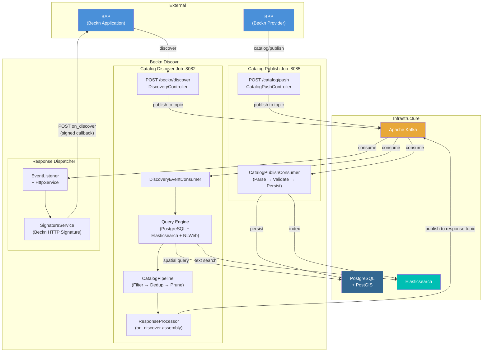

# Beckn Discovr — Architecture Overview

## System Architecture

## Flow Summary

### Catalog Publish (BPP → Discovr)
1. BPP sends `catalog/publish` to Publish Job
2. Published to Kafka topic
3. Consumer parses, validates, persists to **PostgreSQL** and indexes in **Elasticsearch**

### Discover (BAP → Discovr → BAP)
1. BAP sends `discover` request to Discover Job
2. Request validated (schema + Beckn HTTP signature) → published to Kafka → **ACK** returned immediately
3. Consumer picks up request asynchronously:
   - **PostgreSQL/PostGIS** for spatial queries (location-based)
   - **Elasticsearch** for text/keyword search
   - **NLWeb** for natural language search (optional)
4. Results pass through **CatalogPipeline** (schema filter → dedup → prune empty)
5. **ResponseProcessor** assembles `on_discover` response → publishes to Kafka response topic
6. **Response Dispatcher** consumes, signs with Beckn HTTP Signature, POSTs callback to BAP

### Tech Stack
- **Java 17 / Spring Boot** — all three jobs
- **Apache Kafka** — async decoupling between all stages
- **PostgreSQL + PostGIS** — catalog persistence + spatial queries
- **Elasticsearch** — full-text search + attribute filtering
