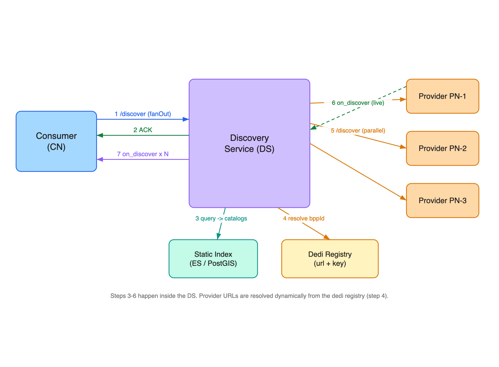
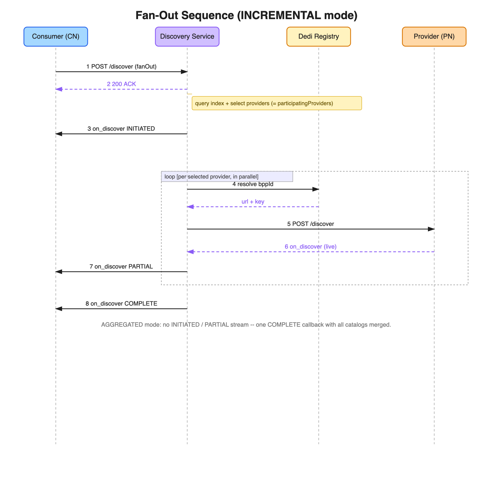

# Fan-Out Discovery — Design Overview

**Status:** Draft for architecture review
**Source:** RFC – Fan-Out Discovery in Beckn Protocol v2.0.0

---

## 1. Problem Statement

Currently, the Discover Service results are pulled from a **static index** containing only pre-published
data (catalogs, resources, offers). It cannot provide **live values** — such as surge pricing,
availability, ETA, or open slots — as the index never maintains these real-time attributes.

In use cases where this live data is what actually decides the choice, the consumer searches **without
seeing it**, and finds out the real price and availability only later, at `/select`. **Fan-Out
Discovery** fixes this: during the search, the Discovery Service can also fetch live data directly from
the providers, so the consumer compares real prices and availability up front.

| Use case | What the consumer needs live |
|----------|------------------------------|
| Ride-hailing | Surge price, driver ETA |
| EV charging | Available slots, live tariff |
| Clinic booking | Open slots today |

---

## 2. Solution Overview

Normally the Discovery Service answers a search using only the data it has already stored from earlier
catalog publishing. That stored data covers fixed things — names, categories, base price, location — but
it cannot know a provider's **price or availability right now**.

Fan-Out Discovery lets the consumer ask the Discovery Service to also **check with the providers
directly, at the moment of the search**. The consumer turns this on by adding a `fanOut` setting to the
request. When it is on, the Discovery Service:

1. finds the providers that match the search (from its stored data),
2. calls each matched provider at the same time to fetch their live information, and
3. sends those live results back to the consumer as each provider replies.

So the consumer sees both the stored details and the live details (current price, ETA, availability)
up front — instead of finding out the real price only later, at `/select`.

A provider takes part in one of two ways:

- **Static provider** — has already published its full list of items (`resources`). Fan-out simply
  **adds** the live details (price, ETA) to those existing items.
- **Dynamic provider** — has published only a **category** (a `ResourceCategory` — *"I offer Economy
  rides, ask me live"* — with no items). Fan-out **creates** the actual items at request time.

A catalog that has a category but no items is the signal that this provider should be called live.

**Running example (used throughout this doc):** a rider searches for an *economy taxi*. Two providers
match — **RideCo**, a **static** provider (its rides are pre-published), and **MetroRide**, a **dynamic**
provider (it published only an "Economy Ride" category and answers live). Every diagram and JSON example
below uses these two.

*(Short names used below — CN, DS, PN, CS, dedi registry — are defined in
[Appendix A](#appendix-a--actors--terms).)*

---

## 3. How It Works

### 3.1 Execution flow



*Editable source: [`assets/fanout-execution-flow.excalidraw`](assets/fanout-execution-flow.excalidraw).*

The consumer makes a single `/discover` call — everything after that is the Discovery Service working
behind the scenes (the numbered arrows in the diagram). It immediately acknowledges the request (1–2),
looks in its stored data to shortlist the matching providers (3), looks up each provider's address and
key from the network registry (4), calls all of them at the same time (5), receives their live replies
(6), and passes the results back to the consumer (7). Any provider that takes longer than `timeoutMs`
is skipped, so one slow provider never holds up the rest.

### 3.2 Sequence diagram (INCREMENTAL)



*Editable source: [`assets/fanout-sequence.excalidraw`](assets/fanout-sequence.excalidraw).*

Read it top to bottom; the boxed `loop` repeats once for each provider (here RideCo, then MetroRide).
The consumer sends the search; the Discovery Service replies with a quick acknowledgement, then a first
callback (**INITIATED**) carrying the data it already had stored. Then, for each provider, it looks up
the provider's address from the registry, calls it, gets the live reply, and forwards it to the consumer
as a **PARTIAL** callback. Once every provider has replied (or timed out), it sends a final **COMPLETE**
callback.

### 3.3 The three touch-points and their schemas

The rest of the doc follows the request lifecycle. Each step has one actor and adds one new schema —
this table is the **schema overview** for the whole feature; full definitions and examples follow in
each section.

| Touch-point | Who does it | What's new in the schema | Section |
|-------------|-------------|--------------------------|---------|
| **Publish** | the **provider** (publisher) → Catalog Service | `Catalog` gains `resourceCategories[]`; `Provider` gains an optional `url` | §4 |
| **Discover** | the **consumer** (CN) → DS, in **fan-out mode** | `intent` gains `fanOut` (type `FanOutDirective`) | §5 |
| **On_Discover** | DS → consumer | each callback gains `fanOutStatus` (type `FanOutStatus`) | §6 |

---

## 4. Publish — what a provider publishes

A provider publishes a `Catalog` to the Catalog Service. For fan-out, a dynamic provider publishes a
category (a `ResourceCategory`) instead of full resources.

### 4.1 Catalog schema

There is **one object — the `Catalog`**. We add a `resourceCategories[]` array alongside the existing
`resources` and `offers`. Each entry in it is a `ResourceCategory` (shown inline below); it only ever
appears inside a catalog. The `anyOf` lets a catalog be valid with **any one** of the three arrays.

```json
{
  "Catalog": {
    "properties": {
      "id": { "type": "string" },
      "descriptor": { "$ref": "#/components/schemas/Descriptor" },
      "provider": { "$ref": "#/components/schemas/Provider" },
      "resources": { "type": "array", "items": { "$ref": "#/components/schemas/Resource" } },
      "offers": { "type": "array", "items": { "$ref": "#/components/schemas/Offer" } },
      "resourceCategories": {
        "type": "array",
        "items": {
          "type": "object",
          "required": ["id", "descriptor"],
          "properties": {
            "id": { "type": "string" },
            "descriptor": { "$ref": "#/components/schemas/Descriptor" },
            "schemaTypes": { "type": "array", "items": { "type": "string", "format": "uri" } },
            "liveAttributes": { "type": "array", "items": { "type": "string" } },
            "categoryAttributes": { "$ref": "#/components/schemas/Attributes" }
          }
        }
      }
    },
    "anyOf": [
      { "required": ["resources"] },
      { "required": ["offers"] },
      { "required": ["resourceCategories"] }
    ]
  }
}
```

**What a `resourceCategories[]` entry contains:**

| Field | Meaning |
|-------|---------|
| `id` | Category identifier (e.g. `CAT-ECONOMY`). Required. |
| `descriptor` | Human name/description of the category. Required. |
| `schemaTypes` | The `@type` URIs of what this category offers — matched against the consumer's intent. |
| `liveAttributes` | UI hint: names the fields that only exist live (surge, ETA…). Does not trigger fan-out. |
| `categoryAttributes` | JSON-LD `@context`/`@type` for the category. |

> **`liveAttributes` is a `ResourceCategory` field** (per the RFC). It lists the field names that only
> have values after a live call — an advisory UI hint. It is **not** a field on `Resource`: a static
> provider's resources carry only `resourceAttributes`.

The `provider` object identifies who owns the catalog and is the fan-out target:

```json
{
  "Provider": {
    "type": "object",
    "required": ["id", "descriptor"],
    "properties": {
      "id": { "type": "string" },
      "descriptor": { "$ref": "#/components/schemas/Descriptor" },
      "availableAt": { "type": "array", "items": { "$ref": "#/components/schemas/Location" } },
      "url": { "type": "string", "format": "uri", "description": "Optional cached base URL; if empty, resolve from the dedi registry via id/bppId." }
    }
  }
}
```

> `id`, `descriptor`, `availableAt` are per the RFC. **`url` is a Discovr extension** — a cache only;
> how the URL is actually resolved is in §7.

### 4.2 Examples — the two publisher types

These are the **published catalogs** (what each provider sends to the Catalog Service). Only the dynamic
provider's **category** declares `liveAttributes`; static resources carry only `resourceAttributes`.

#### Dynamic provider (MetroRide) — publishes a category, **no resources** (the fan-out signal)

```json
{
  "id": "CAT-METRORIDE",
  "descriptor": { "name": "MetroRide Service Catalog" },
  "provider": { "id": "PROV-METRORIDE-01", "descriptor": { "name": "MetroRide" } },
  "resourceCategories": [
    {
      "id": "CAT-ECONOMY",
      "descriptor": { "name": "Economy Ride" },
      "schemaTypes": ["https://schema.beckn.io/mobility/schema/v1/ride.json#RideService"],
      "liveAttributes": ["surgeMultiplier", "etaMinutes", "estimatedFare"]
    }
  ]
}
```

#### Static provider (RideCo) — publishes `resources` with base attributes (no `liveAttributes`)

```json
{
  "id": "CAT-RIDECO",
  "descriptor": { "name": "RideCo Service Catalog" },
  "provider": { "id": "PROV-RIDECO-01", "descriptor": { "name": "RideCo" } },
  "resources": [
    {
      "id": "RIDE-ECO",
      "descriptor": { "name": "Economy" },
      "resourceAttributes": { "@type": "RideService", "vehicleType": "Sedan", "baseFareINR": 50 }
    }
  ]
}
```

> **At fan-out (§6):** MetroRide returns a **new resource** (`RIDE-ECONOMY-LIVE-001`, created live);
> RideCo returns the **same `RIDE-ECO`** with live fields added.

---

## 5. Discover — the fan-out request

The consumer calls `POST /discover` on the DS. Adding a `fanOut` directive to the intent is the opt-in.

### 5.1 The `fanOut` directive (schema type `FanOutDirective`)

`fanOut` is a field inside `intent`; its value is a `FanOutDirective` object:

```json
{
  "FanOutDirective": {
    "type": "object",
    "properties": {
      "maxProviders": { "type": "integer", "default": 20 },
      "timeoutMs": { "type": "integer", "default": 5000 },
      "streamingMode": { "type": "string", "enum": ["INCREMENTAL", "AGGREGATED"], "default": "INCREMENTAL" },
      "schemaTypes": { "type": "array", "items": { "type": "string", "format": "uri" } }
    }
  }
}
```

- `maxProviders` — cap on how many providers to call.
- `timeoutMs` — how long to wait per provider.
- `streamingMode` — `INCREMENTAL` (stream each result) or `AGGREGATED` (one merged result).
- `schemaTypes` — optional filter on which categories to fan out to.

### 5.2 Request — `POST /discover` (Consumer → DS)

```json
{
  "context": {
    "action": "discover",
    "transactionId": "txn-001",
    "messageId": "msg-001",
    "bapUri": "https://bap.example.com"
  },
  "message": {
    "intent": {
      "textSearch": "economy taxi",
      "spatial": [
        {
          "op": "S_DWITHIN",
          "geometry": {
            "type": "Point",
            "coordinates": [77.59, 12.97]
          },
          "distanceMeters": 5000
        }
      ],
      "fanOut": {
        "maxProviders": 10,
        "timeoutMs": 4000,
        "streamingMode": "INCREMENTAL"
      }
    }
  }
}
```

### 5.3 Immediate response (ACK / NACK)

The DS does **not** return results here — only whether the request was accepted. Results arrive later
as `/on_discover` callbacks (§6).

**ACK** — accepted; callbacks will follow.

```json
{
  "message": {
    "status": "ACK",
    "messageId": "msg-001"
  }
}
```

**NACK** — rejected (e.g. schema invalid or auth failed); no callbacks will follow.

```json
{
  "message": {
    "status": "NACK",
    "messageId": "msg-001",
    "error": {
      "code": "SCH_SCHEMA_VALIDATION_FAILED",
      "message": "intent.spatial.op is not supported"
    }
  }
}
```

---

## 6. On_Discover — the fan-out response

The DS delivers results by calling `POST /on_discover` on the consumer's `bapUri`. **Every callback
carries a `fanOutStatus`** that says which stage it is; all callbacks reuse the same `messageId`.

### 6.1 The `fanOutStatus` block (schema type `FanOutStatus`)

```json
{
  "FanOutStatus": {
    "type": "object",
    "required": ["phase"],
    "properties": {
      "phase": { "type": "string", "enum": ["INITIATED", "PARTIAL", "COMPLETE"] },
      "totalProviders": { "type": "integer" },
      "respondedProviders": { "type": "integer" },
      "timedOutProviders": { "type": "integer" },
      "participatingProviders": {
        "type": "array",
        "items": {
          "type": "object",
          "properties": {
            "providerId": { "type": "string" },
            "providerName": { "type": "string" },
            "bppId": { "type": "string" },
            "status": { "type": "string", "enum": ["PENDING", "RESPONDED", "TIMED_OUT", "ERROR"] }
          }
        }
      }
    }
  }
}
```

Worked scenario: two providers match — **RideCo** (static) and **MetroRide** (dynamic).

### 6.2 INCREMENTAL mode (default) — three stages

**Stage 1 — INITIATED**

```json
{
  "message": {
    "catalogs": [
      {
        "id": "CAT-RIDECO",
        "provider": {
          "id": "PROV-RIDECO-01",
          "descriptor": { "name": "RideCo" }
        },
        "resources": [
          {
            "id": "RIDE-ECO",
            "resourceAttributes": {
              "@type": "RideService",
              "baseFareINR": 50
            }
          }
        ]
      },
      {
        "id": "CAT-METRORIDE",
        "provider": {
          "id": "PROV-METRORIDE-01",
          "descriptor": { "name": "MetroRide" }
        },
        "resourceCategories": [
          {
            "id": "CAT-ECONOMY",
            "descriptor": { "name": "Economy Ride" }
          }
        ]
      }
    ],
    "fanOutStatus": {
      "phase": "INITIATED",
      "totalProviders": 2,
      "respondedProviders": 0,
      "timedOutProviders": 0,
      "participatingProviders": [
        { "providerId": "PROV-RIDECO-01", "providerName": "RideCo", "bppId": "bpp.rideco.com", "status": "PENDING" },
        { "providerId": "PROV-METRORIDE-01", "providerName": "MetroRide", "bppId": "bpp.metroride.com", "status": "PENDING" }
      ]
    }
  }
}
```

*Sent first, before any provider is called — the data the DS already had stored, plus the list of
providers it is about to call. The consumer can show these immediately, with a "loading" spinner per
provider.*

**Stage 2 — PARTIAL** (one callback **per provider**, as each replies). Both providers reply, so the
consumer gets **two** PARTIAL callbacks.

**PARTIAL (a) — RideCo (static):** same `RIDE-ECO` id with live fields added, plus an `Offer` carrying
the live price (`considerations`) and a short expiry (`validity.endDate`) so the quote can't be reused
once stale.

```json
{
  "message": {
    "catalogs": [
      {
        "id": "CAT-RIDECO",
        "provider": { "id": "PROV-RIDECO-01" },
        "resources": [
          {
            "id": "RIDE-ECO",
            "resourceAttributes": {
              "@type": "RideService", "vehicleType": "Sedan", "baseFareINR": 50,
              "surgeMultiplier": 1.2, "etaMinutes": 4, "estimatedFareINR": 156
            }
          }
        ],
        "offers": [
          {
            "id": "OFFER-RIDECO-ECO",
            "resourceIds": ["RIDE-ECO"],
            "considerations": [
              { "considerationAttributes": { "@type": "PriceSpecification", "price": 156, "priceCurrency": "INR" } }
            ],
            "validity": { "endDate": "2026-05-28T10:05:00Z" }
          }
        ]
      }
    ],
    "fanOutStatus": {
      "phase": "PARTIAL",
      "totalProviders": 2,
      "respondedProviders": 1,
      "timedOutProviders": 0
    }
  }
}
```

**PARTIAL (b) — MetroRide (dynamic):** a brand-new item (`RIDE-ECONOMY-LIVE-001`) created live, with its
own live `Offer` (price + `validity.endDate`); `respondedProviders` is now `2`.

```json
{
  "message": {
    "catalogs": [
      {
        "id": "CAT-METRORIDE",
        "provider": { "id": "PROV-METRORIDE-01" },
        "resources": [
          {
            "id": "RIDE-ECONOMY-LIVE-001",
            "descriptor": { "name": "Economy Ride" },
            "resourceAttributes": {
              "@type": "RideService", "vehicleType": "Sedan",
              "surgeMultiplier": 1.0, "etaMinutes": 6, "estimatedFareINR": 142
            }
          }
        ],
        "offers": [
          {
            "id": "OFFER-METRORIDE-ECO",
            "resourceIds": ["RIDE-ECONOMY-LIVE-001"],
            "considerations": [
              { "considerationAttributes": { "@type": "PriceSpecification", "price": 142, "priceCurrency": "INR" } }
            ],
            "validity": { "endDate": "2026-05-28T10:05:00Z" }
          }
        ]
      }
    ],
    "fanOutStatus": {
      "phase": "PARTIAL",
      "totalProviders": 2,
      "respondedProviders": 2,
      "timedOutProviders": 0
    }
  }
}
```

> **How the consumer uses each PARTIAL** (matched by the resource `id`):
> - **RideCo (static, same id `RIDE-ECO`)** → update the item already shown, filling in the live fields.
> - **MetroRide (dynamic, new id `RIDE-ECONOMY-LIVE-001`)** → add it as a new item.

**Stage 3 — COMPLETE**

```json
{
  "message": {
    "catalogs": [],
    "fanOutStatus": {
      "phase": "COMPLETE",
      "totalProviders": 2,
      "respondedProviders": 2,
      "timedOutProviders": 0
    }
  }
}
```

*A "we're done" signal only — it carries no catalogs because the data was already delivered in the
INITIATED and PARTIAL callbacks. It tells the consumer no more callbacks are coming, and gives the final
tally; any providers that ran out of time appear in `timedOutProviders`.*

### 6.3 AGGREGATED mode — one stage

No INITIATED, no per-provider PARTIAL. The DS waits for all providers (or `timeoutMs`), combines
everything, and sends a **single COMPLETE** — and here COMPLETE **does** carry all the catalogs:

```json
{
  "message": {
    "catalogs": [ "{ ...RideCo live catalog... }", "{ ...MetroRide live catalog... }" ],
    "fanOutStatus": {
      "phase": "COMPLETE",
      "totalProviders": 2,
      "respondedProviders": 2,
      "timedOutProviders": 0
    }
  }
}
```

Each catalog looks the same as a PARTIAL catalog above — just delivered together in one callback instead
of streamed. Simpler for the consumer, but nothing shows until the slowest provider replies (or times out).

| Mode | Callbacks the consumer receives | COMPLETE carries | Best for |
|------|---------------------------------|------------------|----------|
| **INCREMENTAL** (default) | Stage 1 `INITIATED` + N × Stage 2 `PARTIAL` + Stage 3 `COMPLETE` | empty `catalogs` (already streamed) | Mobile / progressive UI |
| **AGGREGATED** | one `COMPLETE` | all catalogs combined | Web / comparison tables |

---

## 7. Provider URL Resolution

To call a provider live, the DS needs its web address. **That address is not included in any message** —
the messages only carry the provider's id, not where to reach it:
- `catalog.provider` carries `id`, `descriptor`, `availableAt` (plus the optional `provider.url` cache
  from §4.1 — a Discovr extension, see the note below).
- `fanOutStatus.participatingProviders[]` carries `providerId`, `providerName`, `bppId`, `status` — no URL.

So the DS looks the address up itself, from the network (dedi) registry, using the provider's `bppId`:

```
bppId  ──registry lookup──▶  { base_url, signing_public_key }
POST {base_url}/discover           # done for each matched provider, in parallel
verify the on_discover reply using the key
```

- **One search → many providers:** the DS resolves each `bppId` and calls them all at the same time.
- **Many DS instances:** the registry is a single shared source of truth, so any DS instance resolves
  the same `bppId` to the same address — no shared state or sticky routing needed. Each instance caches
  the result for a while (TTL).

> **Discovr extension — optional cache.** A `provider.url` (§4.1) may be included to skip the lookup: if
> present, the DS validates it (HTTPS, no private IPs) and uses it; if absent, it resolves from the
> registry via `bppId`. The signing key **always** comes from the registry; a supplied `url` is only a
> shortcut, never trusted over the registry entry.

---

## 8. Provider Selection

A search can match far more providers than we want to call live (e.g. 200 taxi providers). The DS
can't call them all — the consumer would wait on the slowest, every provider gets hit on every search,
and hundreds of results overwhelm the screen. So the DS **shortlists** down to at most `maxProviders`.

It picks the list in five simple steps:

1. **Filter** — keep only providers that qualify: inside the searched area and matching the requested
   `schemaTypes`. (Pass/fail.)
2. **Rank** — order the rest by how good a match they are: closeness/relevance, and how reliably they've
   responded recently (and rating, if the network has one).
3. **Trim** — keep the top `maxProviders` from that ranked list.
4. **Skip the unhealthy** — a provider that keeps timing out or erroring is set aside for a while (a
   "circuit breaker"), so a slot isn't wasted on a known-bad provider.
5. **Keep it varied** — no single operator may take more than half the slots, so one big operator can't
   fill the whole result set.

The result of these steps is the `participatingProviders` list shown in the INITIATED callback — i.e.
the exact set the DS is about to call.

> **Open decision:** whether this selection is mandatory for every DS, or only the filter step is
> required and the ranking is left to each DS to tune.

---

## 9. Error Handling

Three things can go wrong during fan-out. In every case the consumer is never left hanging:

| What goes wrong | What the DS does | What the consumer sees |
|-----------------|------------------|------------------------|
| **One provider** errors or times out | Drops just that provider and continues; marks its `status` as `ERROR` / `TIMED_OUT` | Results from the others; the failed one is simply absent |
| **All providers fail** (found, but none reply in time) | Still sends a final **COMPLETE** with empty `catalogs` + counts | `INITIATED` → `COMPLETE` (empty) |
| **No providers match** at all | Does **not** start fan-out | **`202 AckNoCallback`** — no callbacks at all |

- A single failure never sinks the search.
- "Found but none replied" still ends with COMPLETE, so the consumer knows it's over.
- "Nothing matched" never starts fan-out — the consumer is told immediately.

---

## 10. Challenges & Open Questions

| # | Challenge | Why it matters |
|---|-----------|----------------|
| 1 | **Provider selection** | When hundreds match, the ranking must be fair and fast (see §8). Whether the algorithm is mandatory or advisory is open. |
| 2 | **Latency & amplification** | One search becomes many live calls. Needs `maxProviders`, timeouts, and circuit breakers so it can't be abused to flood providers. |
| 3 | **Stale live quotes** | Live prices expire fast — a live offer needs a short expiry (`validity.endDate`). |
| 4 | **Partial failures** | Providers that error or time out must be dropped cleanly and never hold up COMPLETE. |

---

## Appendix A — Actors & Terms

| Term | Meaning |
|------|---------|
| **Consumer (CN)** | Buyer-side app that issues `/discover` (a Beckn **BAP**). Receives `/on_discover` callbacks at its `bapUri`. |
| **Discovery Service (DS)** | Indexes published catalogs and answers `/discover`. For fan-out it also calls providers live. |
| **Provider (PN)** | Seller node that can answer a live `/discover` (a Beckn **BPP**). Identified by `bppId`. |
| **Catalog Service (CS)** | Where providers publish catalogs; the DS indexes from it. |
| **dedi registry** | Network registry that resolves a `bppId` → the provider's web address (URL) and signing key. |
