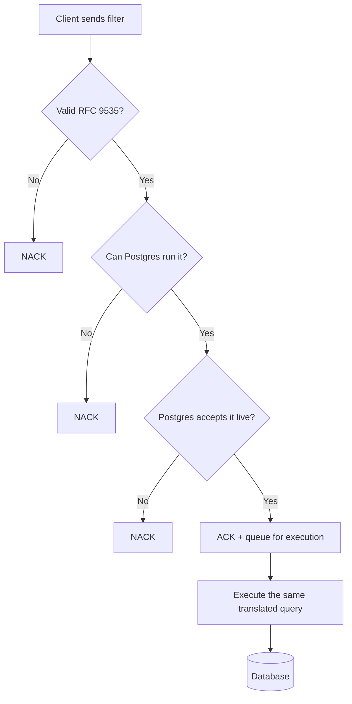

# Design: RFC 9535 JSONPath Filtering with Pluggable Database Translation

**Status:** Under Review
**Service:** `catalog-discover-job` (Beckn Discovr)
**Date:** 2026-06-30

---

## 1. Problem Statement

### How filtering works today

Clients filter catalog resources by sending a JSONPath-like string in
`message.intent.filters.expression`. Discovr doesn't understand this string itself — it
just hands it to PostgreSQL as-is:

- **Validation:** ask Postgres if it can parse the string. If yes, it's "valid." If no, NACK.
- **Execution:** run the same string against the database, unchanged.

So Postgres decides what's valid, and Postgres is the only thing that ever runs the filter.
Discovr has no independent understanding of the filter itself. This causes two problems:

1. **Clients must write Postgres's dialect, not real JSONPath.** Postgres has its own path
   language (SQL:2016), which looks like but isn't RFC 9535 — the actual JSONPath standard.
   A filter written correctly in RFC 9535 gets rejected today, and vice versa (see §3 for
   examples).
2. **We're locked into Postgres.** Validation and execution both run on the exact same
   Postgres string. If we ever add or switch to a different engine (Elasticsearch, etc.),
   there's nothing to reuse — we'd rebuild filtering from scratch and break every existing
   client filter.

---

## 2. Goals

1. **Let clients use real RFC 9535 JSONPath**, not Postgres's dialect.
2. **Keep backward compatibility** — filters already written in Postgres's dialect must
   keep working.

---

## 3. Design

### Approach

One front end understands RFC 9535 and turns it into a neutral, engine-agnostic form.
A separate, swappable back end then turns that into whatever query syntax the current
database needs — Postgres, for now. Adding a new engine later just means writing one new
back end. The front end, and what clients write, never changes.

### Why not just use a library

We checked for an existing library that already does "read RFC 9535, output a query in
another language." None exists. Every RFC 9535 library we found just evaluates the
expression in memory against JSON already loaded — it doesn't translate to a different
query language. Makes sense: every database has its own, incompatible query language, so
there's no single target for a generic library to aim at. That's why we're building this
ourselves instead of reusing something.

### Validate first, execute later

A bad filter should fail fast and clearly, not get silently dropped later. So we check it
in three steps before even acknowledging the request:

1. **Is it valid RFC 9535?** (syntax check)
2. **Can Postgres actually run this construct?** Some valid RFC 9535 constructs have no
   Postgres equivalent (see §4) and get rejected here.
3. **Does Postgres actually accept the translated query?** A final live check, to catch
   anything the first two steps missed.

Only if all three pass do we acknowledge the request and queue it. Later, execution reuses
the exact same translated query — so nothing that passed validation can behave differently
at execution time.

### A few syntax differences, as examples

| Feature | RFC 9535 | Postgres |
| :--- | :--- | :--- |
| Filter selector | `[?(@.price < 10)]` | `? (@.price < 10)` |
| String quotes | single or double | double only |
| Existence check | `[?(@.details)]` | `exists(@.details)` |
| Regex | `match(@.name, 'regex')` | `@.name like_regex "regex"` |
| Array index | `[0]`, `[-1]` | `[0]`, `[last]` |

Small differences, but enough that a filter valid in one is invalid in the other — which is
why a real translation step is needed, not a simple find-and-replace.

---

## 4. Challenges with the Proposed Design

### Some RFC 9535 features just don't map to Postgres

| RFC 9535 feature | Why Postgres can't do it |
| :--- | :--- |
| Recursive descent (`..`) | Postgres's closest match gives duplicates and a different order — wrong result. |
| Wildcard on unknown type (`.*`) | RFC's wildcard works on objects and arrays; Postgres's only works on objects. |
| Filtering the root itself (`$[?…]`, `$[0]`) | Postgres treats the root as one value, not a list to iterate. |
| Comparing two paths (`@.a == @.b`) | RFC's equality rules here aren't reproducible in Postgres. |
| Existence check on multiple matches (`@.tags[*]`) | Postgres's existence check behaves differently once more than one match is possible. |
| `count()` | RFC counts nodes matched; Postgres's closest function counts array length — not the same thing. |
| Slice with a step, or negative step (`[::2]`, `[::-1]`) | Postgres only supports a plain, continuous range. |
| A few regex features (e.g. Unicode classes) | Postgres's regex engine doesn't support them. |

These are mostly edge cases. Normal Beckn filters — equality, ranges, AND/OR, checking
fields across catalogs/resources/offers — all work fine.

### If we can't translate it, we reject it — we never guess

When a filter can't be faithfully translated, we send a clear NACK instead of trying a
partial or "close enough" translation. A client either gets a correct result, or a clear
"not supported" — never a silently wrong answer.

We also considered falling back to filtering results ourselves in application code instead
of in the database, for the cases Postgres can't handle. We ruled this out: the filter
usually narrows the result set the most, so skipping it in the database query means pulling
a huge, unfiltered result set into memory first — not practical at scale.

### We test this against the official spec, not just claim it

We run the translated queries against the official JSONPath Compliance Test Suite and
compare results to the expected output:

- Everything we currently accept and run gives the exact right answer — no wrong results.
- **Known gap:** a small number of inputs that the spec says are invalid are currently
  accepted instead of rejected (the parser is a bit too lenient in some edge cases). This
  doesn't cause wrong answers on valid queries, but it's a gap we should close.

---

## 5. Benefits of the Proposed Design

- **We're not locked into Postgres.** Since the front end doesn't know about Postgres, and
  all Postgres-specific logic is behind one swappable piece, adding another engine later
  (Elasticsearch, etc.) means writing one new piece — not a rewrite.
- **Bad filters fail fast.** Clients get a clear NACK immediately, instead of the request
  silently failing later in async processing.
- **We can prove RFC 9535 compliance, not just claim it.** Because we use a real grammar
  instead of ad hoc string matching, we can run it against the official compliance test
  suite and show the results.
