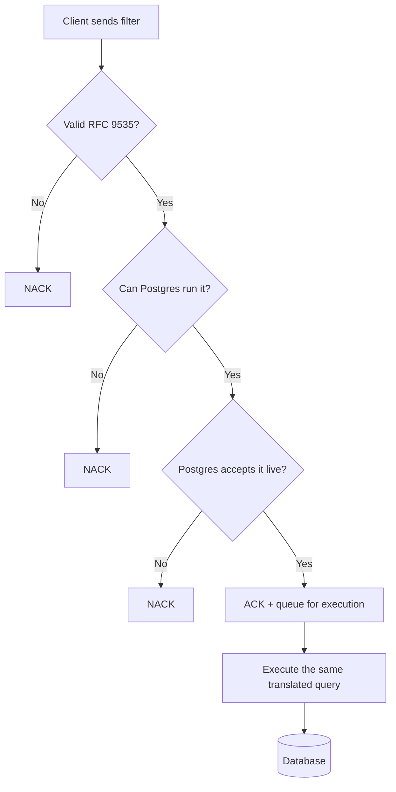

# Design: RFC 9535 JSONPath Filtering with Pluggable Database Translation

**Status:** Under Review
**Service:** `catalog-discover-job` (Beckn Discovr)
**Date:** 2026-06-30

---

## 1. Problem Statement

### How filtering works today

Clients filter catalog resources by sending a JSONPath-like string in
`message.intent.filters.expression`. Discovr doesn't understand this string itself. It just
hands it to PostgreSQL as-is:

- **Validation:** ask Postgres if it can parse the string. If yes, ACK. If no, NACK.
- **Execution:** run the same string against the database, unchanged.

So Postgres decides what's valid, and Postgres is the only thing that ever runs the filter.
Discovr has no independent understanding of the filter itself. This causes two problems:

1. **Clients must write Postgres's dialect, not real JSONPath.** Postgres has its own path
   language (SQL:2016), which looks like RFC 9535 but isn't. RFC 9535 is the actual
   JSONPath standard. A filter written correctly in RFC 9535 gets rejected today, and vice
   versa (see §3 for examples).
2. **The system is locked into Postgres.** Validation and execution both run on the exact
   same Postgres string. Adding or switching to a different engine (Elasticsearch, etc.)
   would mean rebuilding filtering from scratch, breaking every existing client filter.

---

## 2. Goals

1. **Let clients use real RFC 9535 JSONPath**, not Postgres's dialect.
2. **Keep backward compatibility.** Filters already written in Postgres's dialect must
   keep working.

---

## 3. Design

### High-level flow

At a high level, a filter goes through three steps:

```
Client sends filter (RFC 9535)  →  Validate  →  Translate to the current database's query language  →  Execute
```

Each step is explained below.

### How validation works

A bad filter should fail fast and clearly, not get silently dropped later. So it's checked
in three steps before the request is even acknowledged:

1. **Is it valid RFC 9535?** A syntax check against the RFC 9535 grammar.
2. **Can Postgres actually run this?** Some valid RFC 9535 filters have no way to run on
   Postgres (see §4). These are caught and rejected here. Catching this requires actually
   attempting the translation step (below), so translation and this check happen together.
3. **Does Postgres actually accept the translated query?** One last live check against the
   real database, to catch anything the first two steps missed.

If all three steps pass, the request is acknowledged (ACK) and queued for execution. If any
step fails, it's rejected (NACK). At execution time, the same translated query from step 2
is reused, so a filter that passed validation can't behave differently later.



### How translation works

Once a filter is confirmed valid, it needs to become a real database query. This happens in
two parts:

1. **Read the filter.** Break the RFC 9535 string down into its parts: the field being
   checked, the comparison, the value, and so on.
2. **Rewrite each part for the target database.** Each part is converted into the matching
   syntax for whatever database is running today (Postgres). A few examples:

   | Feature | RFC 9535 | Postgres |
   | :--- | :--- | :--- |
   | Filter selector | `[?(@.price < 10)]` | `? (@.price < 10)` |
   | String quotes | single or double | double only |
   | Existence check | `[?(@.details)]` | `exists(@.details)` |
   | Regex | `match(@.name, 'regex')` | `@.name like_regex "regex"` |
   | Array index | `[0]`, `[-1]` | `[0]`, `[last]` |

   Small differences, but enough that a filter valid in one is invalid in the other. That's
   why this rewrite step exists instead of a simple find-and-replace.

Splitting "read the filter" from "rewrite it for a target database" is what makes the
design swappable: adding a new database later only means writing a new rewrite step. The
read step, and what clients write, never changes.

### Why not just use a library

A search for an existing library that already does "read RFC 9535, output a query in
another language" turned up nothing. Every RFC 9535 library found just evaluates the
expression in memory against JSON already loaded; it doesn't translate to a different query
language. That tracks: every database has its own, incompatible query language, so there's
no single target for a generic library to aim at. Hence building this from scratch instead
of reusing something.

---

## 4. Challenges with the Proposed Design

### Some RFC 9535 features just don't map to Postgres

| RFC 9535 feature | Why Postgres can't do it |
| :--- | :--- |
| Recursive descent (`..`) | Postgres's closest match gives duplicates in a different order, which is the wrong result. |
| Wildcard on unknown type (`.*`) | RFC's wildcard works on objects and arrays; Postgres's only works on objects. |
| Filtering the root itself (`$[?…]`, `$[0]`) | Postgres treats the root as one value, not a list to iterate. |
| Comparing two paths (`@.a == @.b`) | RFC's equality rules here aren't reproducible in Postgres. |
| Existence check on multiple matches (`@.tags[*]`) | Postgres's existence check behaves differently once more than one match is possible. |
| `count()` | RFC counts nodes matched. Postgres's closest function counts array length, which isn't the same thing. |
| Slice with a step, or negative step (`[::2]`, `[::-1]`) | Postgres only supports a plain, continuous range. |
| A few regex features (e.g. Unicode classes) | Postgres's regex engine doesn't support them. |

These are mostly edge cases. Normal Beckn filters (equality, ranges, AND/OR, checking
fields across catalogs, resources, and offers) all work fine.

### If it can't be translated, it's rejected, never guessed

When a filter can't be faithfully translated, the service sends a clear NACK instead of
trying a partial or "close enough" translation. A client either gets a correct result, or a
clear "not supported." Never a silently wrong answer.

An alternative was considered: filtering results in application code instead of in the
database, for the cases Postgres can't handle. This was ruled out because the filter
usually narrows the result set the most. Skipping it in the database query would mean
pulling a huge, unfiltered result set into memory first, which isn't practical at scale.

### Tested against the official spec, not just claimed

The translated queries are run against the official JSONPath Compliance Test Suite and
compared to the expected output:

- Everything currently accepted and run gives the exact right answer. No wrong results.
- **Known gap:** a small number of inputs that the spec says are invalid are currently
  accepted instead of rejected (the parser is a bit too lenient in some edge cases). This
  doesn't cause wrong answers on valid queries, but it's a gap that should be closed.

---

## 5. Benefits of the Proposed Design

- **No lock-in to Postgres.** Since the front end doesn't know about Postgres, and all
  Postgres-specific logic is behind one swappable piece, adding another engine later
  (Elasticsearch, etc.) means writing one new piece, not a rewrite.
- **Bad filters fail fast.** Clients get a clear NACK immediately, instead of the request
  silently failing later in async processing.
- **RFC 9535 compliance can be proven, not just claimed.** Because it uses a real grammar
  instead of ad hoc string matching, it can be run against the official compliance test
  suite and the results shown.
