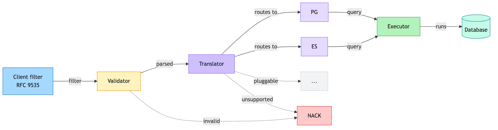

# Design: RFC 9535 JSONPath Filtering with Pluggable Database Translation

**Status:** Under Review
**Service:** `catalog-discover-job` (Beckn Discovr)
**Date:** 2026-06-30

---

## 1. Problem Statement

### How filtering works today

Clients filter catalog resources by sending a JSONPath-like string in
`message.intent.filters.expression`. Discovr doesn't understand this string itself. It just
hands it to the database as-is:

- **Validation:** ask the database if it can parse the string. If yes, ACK. If no, NACK.
- **Execution:** run the same string against the database, unchanged.

So the database decides what's valid, and the database's own path language is the only
thing that ever runs the filter. Discovr has no independent understanding of the filter
itself. This causes two problems:

1. **Clients must write the database's dialect, not real JSONPath.** Today's database has
   its own path language (SQL:2016), which looks like RFC 9535 but isn't. RFC 9535 is the
   actual JSONPath standard. A filter written correctly in RFC 9535 gets rejected today, and
   vice versa (see §3 for examples).
2. **The system is locked into one database.** Validation and execution both run on the
   exact same database-specific string. Switching to a different database, or adding a
   second one, would mean rebuilding filtering from scratch, breaking every existing client
   filter.

---

## 2. Goals

1. **Let clients use real RFC 9535 JSONPath**, not any one database's dialect.
2. **Keep backward compatibility.** Filters already written in the current database's
   dialect must keep working.

---

## 3. Design

### High-level flow

The client's raw filter (RFC 9535) flows left to right through a **Validator**, then a
**Translator**, then an **Executor**, which runs the translated query against the
**Database**. A filter the Validator can't parse, or the Translator can't convert, is
rejected with a NACK instead of moving forward. Each stage is explained below.

### Validator

- **What it takes:** the raw filter string the client sent.
- **What it checks, in order, before the request is even acknowledged:**
  - Is it valid RFC 9535? A syntax check against the RFC 9535 grammar.
  - Can the current database actually run it? Some valid RFC 9535 filters still have no way
    to run on the current database (see §4). Checking this means attempting the translation
    itself, so this check and the Translator are the same piece of work.
  - Does the database actually accept the translated query? One last live check against the
    real database, to catch anything the first two checks missed.
- **Why the Validator does this instead of just the Translator and Executor:** discover
  requests are ACKed immediately and processed later, asynchronously. Once that async
  processing starts, there's no way back to send a NACK. So the Validator has to run the
  Translator's and Executor's checks early, as a dry run, to decide ACK or NACK before that
  window closes. It's the same work, just done up front instead of later.
- **What it produces:** if all three checks pass, the request is acknowledged (ACK) and
  queued. If any check fails, the request is rejected (NACK).
- **What it's built with, and why:** the first check uses **ANTLR4**, a widely used parser
  generator. Given a formal grammar for RFC 9535, it generates a parser automatically,
  instead of one being hand-written from scratch. Hand-writing a parser for a grammar this
  size is slow to build and easy to get subtly wrong; ANTLR4 is a standard, well-tested tool
  for exactly this problem.
- **What it doesn't tell you:** the first check only confirms *format*, that is, whether the
  string is valid RFC 9535 syntax. It says nothing about whether the database can run it.
  That's what the second and third checks are for.

### Translator

- **What it takes:** a filter already confirmed to be valid RFC 9535 syntax, and which
  database it needs to run on.
- **What it produces:** an equivalent query string, written in that database's own query
  language.
- **Example:** a real Discovr filter, matching resources from a specific manufacturer.
  - Input (RFC 9535): `$.catalogs[*].resources[?(@.resourceAttributes.packagedGoodsDeclaration.manufacturerOrPacker.name == 'Hindustan Unilever Limited')]`
  - Output (today's target database): `$.catalogs[*].resources[*] ? (@.resourceAttributes.packagedGoodsDeclaration.manufacturerOrPacker.name == "Hindustan Unilever Limited")`
- **How it decides what to emit:** the Translator isn't one block of logic that handles
  every database. It's a thin dispatcher in front of one sub-translator per database, one
  for each database it currently supports. The dispatcher looks at which database the
  request needs to run on and hands the filter to that database's sub-translator, which
  emits that database's syntax. Supporting a new database later means plugging in one new
  sub-translator, not rewriting the existing ones.
- **What it's built with, and why:** a search for an existing library that already does
  "read RFC 9535, output a query in another language" turned up nothing. Every RFC 9535
  library found only evaluates the filter in memory against JSON already loaded; it doesn't
  emit another query language. So the translator is hand-built, walking the same structure
  the Validator's parser produces, using the **visitor pattern**, a standard way of walking
  a tree-shaped structure and doing something at each piece.
- **A few examples of how the syntax differs:**

  | Feature | RFC 9535 | Today's target database |
  | :--- | :--- | :--- |
  | Filter selector | `resources[?(@.resourceAttributes.packagedGoodsDeclaration.manufacturerOrPacker.name == 'Hindustan Unilever Limited')]` | `resources[*] ? (@.resourceAttributes.packagedGoodsDeclaration.manufacturerOrPacker.name == "Hindustan Unilever Limited")` |
  | String quotes | single or double, e.g. `'Hindustan Unilever Limited'` | double only, e.g. `"Hindustan Unilever Limited"` |
  | Existence check | `[?(@.resourceAttributes.rating)]` | `exists(@.resourceAttributes.rating)` |
  | Regex | `match(@.resourceAttributes.name, 'Unilever.*')` | `@.resourceAttributes.name like_regex "Unilever.*"` |
  | Array index | `[0]`, `[-1]` | `[0]`, `[last]` |

- **How it decides what's translatable:** the walk has one step per RFC 9535 construct, path
  segment, comparison, function call, and so on. Each step only emits output if the target
  database's dialect has a direct equivalent for that exact construct. If it doesn't, that
  step rejects the filter on the spot, instead of emitting a guess or a workaround. This is
  why the list in §4 is exact and known upfront: it's precisely the set of constructs whose
  step has no matching output for the current database, not a fuzzy or evolving judgment
  call.
- **What it can't translate:** some valid RFC 9535 filters have no equivalent at all on the
  current database (e.g. recursive descent, `count()`, negative slice steps; see §4 for the
  full list).
- **What happens then:** the translator never guesses at a partial translation. If a filter
  can't be faithfully translated, the request is rejected with a NACK saying the expression
  isn't supported, instead of running something that might quietly give the wrong answer.

### Executor

- **What it takes:** the translated query string from the Translator, exactly as it was
  validated. It's never re-translated.
- **What it does:** sends the query to the database and runs it, returning the matching
  resources.
- **How it connects:** the translated string is passed to the database as a **bind
  parameter**, never pasted directly into the query text. The database always treats it as a
  value to match against, never as something to execute. This is what keeps the filter safe
  to run even though it's fully client-supplied.
- **Why nothing changes between checking and running:** the Executor reuses the exact query
  the Validator already proved works, so a filter can't behave differently at execution time
  than it did during validation.

---

## 4. Challenges with the Proposed Design

### Some RFC 9535 features just don't map to the current database

| RFC 9535 feature | Example | Why the current database can't do it |
| :--- | :--- | :--- |
| Recursive descent (`..`) | `$..name` | The closest operator visits nodes in a different order, returns duplicates, and also matches container nodes RFC wouldn't. A filter written expecting RFC's single, ordered set of matches would silently get a different, larger, differently-ordered set instead. |
| Wildcard on unknown type (`.*`) | `$.resources.*` | RFC's `*` selects children of both objects and arrays with one operator. The current database has two separate operators, one for objects and one for arrays, so a wildcard on a value whose shape isn't known ahead of time has no single matching operator to translate to. |
| Filtering the root itself (`$[?…]`, `$[0]`) | `$[?@.active]` | The current database's root-level behavior depends on whether the document is treated as an array or an object, and handles that split differently than RFC's type-agnostic root. Discover also requires every path to start with a member access (e.g. `$.catalogs...`), so root-level filters are rejected structurally, not evaluated and found wrong. |
| Comparing two paths (`@.a == @.b`) | `$.resources[?(@.price == @.discountedPrice)]` | RFC compares two paths using nodelist rules (for example, two absent values count as equal). The current database's comparison only works between a path and a fixed value, with its own rules for absent or mismatched values, so it can't reproduce RFC's result when both sides are paths. |
| Existence check on multiple matches (`@.tags[*]`) | `$.resources[?(@.tags[*])]` | RFC's existence check passes whenever the match is non-empty, even for a wildcard or multi-match path. The current database's existence check only maps cleanly onto a single, plain value (like `@.a.b`); stretching it to a multi-match path hits the same object/array and duplication gaps as recursive descent and wildcards. |
| `count()` | `$.resources[?(count(@.tags[*]) == 3)]` | RFC's `count()` counts how many nodes a query matched. The closest function on the current database counts array length instead, which is a different number whenever the queried value isn't already a plain array, so there's no faithful equivalent. |
| Slice with a step, or negative step (`[::2]`, `[::-1]`) | `$.resources[0:10:2]` | The current database's slice syntax only understands a plain, continuous range (start to end); it has no concept of a step or stride, so a stepped or reversed slice has nothing to translate to. |
| A few regex features (e.g. Unicode classes) | `match(@.resourceAttributes.name, '\p{L}+')` | RFC's regex flavor supports Unicode property classes like `\p{L}`. The current database's regex engine uses a different flavor that doesn't understand that syntax, so the filter is rejected at translation time instead of being passed through to fail at query time. |

These are mostly edge cases. Normal Beckn filters (equality, ranges, AND/OR, checking
fields across catalogs, resources, and offers) all work fine.

### If it can't be translated, it's rejected, never guessed

When a filter can't be faithfully translated, the service sends a clear NACK instead of
trying a partial or "close enough" translation. A client either gets a correct result, or a
clear "not supported." Never a silently wrong answer.

An alternative was considered: filtering results in application code instead of in the
database, for the cases the database can't handle. This was ruled out because the filter
usually narrows the result set the most. Skipping it in the database query would mean
pulling a huge, unfiltered result set into memory first, which isn't practical at scale.

### Tested against the official spec, not just claimed

The translated queries are run against the official JSONPath Compliance Test Suite and
compared to the expected output:

- Everything currently accepted and run gives the exact right answer. No wrong results.
- **Known gap:** a small number of inputs that the spec says are invalid are currently
  accepted instead of rejected (the parser is a bit too lenient in some edge cases). This
  doesn't cause wrong answers on valid queries, but it's a gap that should be closed.

---

## 5. Benefits of the Proposed Design

- **No lock-in to any one database.** The client-facing side doesn't know which database is
  behind it, and all database-specific logic is behind one swappable piece. Supporting
  another database later means writing one new translation path, not a rewrite.
- **Bad filters fail fast.** Clients get a clear NACK immediately, instead of the request
  silently failing later in async processing.
- **RFC 9535 compliance can be proven, not just claimed.** Because it uses a real grammar
  instead of ad hoc string matching, it can be run against the official compliance test
  suite and the results shown.
