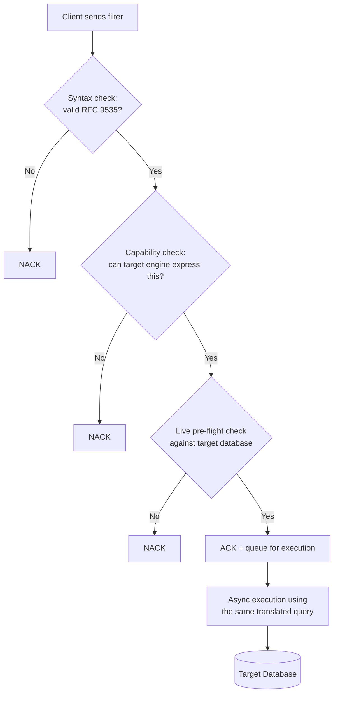

# Design: RFC 9535 JSONPath Filtering with Pluggable Database Translation

**Status:** Under Review
**Service:** `catalog-discover-job` (Beckn Discovr)
**Date:** 2026-06-30

---

## 1. Problem Statement

### How filtering works in Discovr today

The Beckn Discovr service lets clients filter catalog resources by passing a JSONPath-like
expression in `message.intent.filters.expression`. Today, Discovr does not parse or
interpret that expression with any logic of its own — it hands the raw string straight to
PostgreSQL:

- **Validation** asks a *live PostgreSQL connection* to parse the string as its native
  `jsonpath` type. If Postgres's own parser accepts it, the filter is considered valid; if
  Postgres rejects it, the request is NACKed.
- **Execution** runs the same string, unchanged, through Postgres's native JSONB matching
  operator.

In other words, **Postgres's own parser is the only thing deciding what a "valid filter"
is, and Postgres's own path language is the only thing that ever runs.** There is no layer
in Discovr that owns or understands the filter syntax independently of Postgres. That one
design choice — delegating both validation and execution entirely to the database — is the
root cause of two problems:

1. **Clients are forced to write PostgreSQL's dialect, not JSONPath.** Because Postgres's
   parser *is* the validator, whatever Postgres accepts as a `jsonpath` literal is what
   "works" as a filter — and that is **PostgreSQL SQL/JSON path** (SQL:2016, ISO/IEC 9075-2),
   not the IETF's actual JSONPath standard, **RFC 9535**. The two look similar — both
   descend from the same 2007 Goessner JSONPath convention — but come from different
   standards bodies, built for different purposes, and diverge on filter-selector notation,
   quoting rules, recursive descent, and more (comparison in §3). A client writing the
   RFC-correct expression against today's service is rejected as invalid SQL/JSON path, and
   vice versa.
2. **The filter mechanism cannot survive a database change.** Because there is no
   abstraction between "the filter a client wrote" and "the Postgres-specific string that
   gets executed," the two are the same string — validation and execution are Postgres,
   end to end, with nothing in between that Discovr controls. If Discovr ever switches its
   storage engine, or routes search queries to Elasticsearch, Cassandra, or another document
   store, there is no seam to plug a different engine into: the entire validation and
   execution mechanism has to be rebuilt from scratch for that engine, and every existing
   client filter breaks in the meantime.

---

## 2. Goals

Directly against the two problems above, this design must:

1. **Allow clients to write and query using canonical RFC 9535 JSONPath** — the real IETF standard — instead of being forced into PostgreSQL's dialect.
2. **Maintain backward compatibility** — existing clients already using the legacy PostgreSQL SQL/JSON path dialect must continue to work unchanged.

---

## 3. Design

### Approach

A single front end understands RFC 9535 and produces an engine-neutral representation of
the filter. A separate, pluggable back end then converts that representation into the
query syntax of whichever database engine is actually running the query today — PostgreSQL.
Adding support for a different engine later means adding one new back end; the front end,
and everything a client writes, stays unchanged.

### Why build this instead of using an existing library

Before committing to building a parser/translator, we checked whether something already
does "parse RFC 9535 → emit an equivalent query in another engine's language." It doesn't
exist: every RFC 9535-compliant implementation we found (across Java, JS/TS, Go, .NET) is
an **in-memory evaluator** — it parses the expression and walks a JSON value already loaded
into memory, returning matching nodes. None of them translate the expression into another
query language, including query engines that would seem well-positioned to (e.g.
Elasticsearch's own newer JSONPath support still evaluates in place rather than emitting
its native Query DSL). This is a semantic-mismatch problem — JSONPath is schema-less
hierarchical traversal; relational/search engines have their own, mutually incompatible,
native query languages — so there's no single "translate to X" target a generic library
could standardize on. That gap is why a custom parser and pluggable per-engine translator
is being built rather than adopting a dependency.

### Validation, then execution

Because a bad filter should fail loudly and immediately rather than be silently dropped
later in async processing, the design validates the filter synchronously, before the
client's request is even acknowledged:

1. **Syntax check** — is this valid RFC 9535?
2. **Capability check** — even if it's syntactically valid RFC 9535, can the *target* engine
   (PostgreSQL today) actually express this construct? Some RFC constructs have no faithful
   equivalent in PostgreSQL's dialect (see §4) and are rejected here.
3. **Live pre-flight check** — a final check against the real database, to catch anything
   the first two steps couldn't (e.g. an engine-specific parsing quirk).

Only a filter that clears all three tiers is acknowledged and queued for execution. The
same translated query is reused, unchanged, when the request is actually executed — so a
filter that was accepted can never fail differently at execution time than it did at
validation time.

### Syntax differences that rule out a straight pass-through

| Feature | RFC 9535 | PostgreSQL SQL/JSON path |
| :--- | :--- | :--- |
| Filter selector | Bracketed: `[?(@.price < 10)]` | Standalone: `? (@.price < 10)` |
| String literals | Single or double quotes | Double quotes only |
| Existence guard | `[?(@.details)]` | `exists(@.details)` |
| Regular expressions | `match(@.name, 'regex')` | `@.name like_regex "regex"` |
| Array subscripts | `[0]`, `[-1]` | `[0]`, `[last]` |

These aren't cosmetic differences — they're why a filter written correctly against one
standard is rejected by the other today, and why a translation step (rather than a
string rewrite) is needed.

---

## 4. Challenges with the Proposed Design

### Not every RFC 9535 construct can be faithfully translated

PostgreSQL's own JSON path dialect is a narrower language than RFC 9535, and some RFC
constructs have no representable equivalent in it:

| RFC 9535 construct | Why PostgreSQL can't faithfully express it |
| :--- | :--- |
| Recursive descent (`..`) | PostgreSQL's closest equivalent returns duplicates, a different order, and extra intermediate nodes — not the same result set. |
| Type-agnostic wildcard (`.*`, not on a known array) | RFC's wildcard matches children of both objects and arrays; PostgreSQL's dot-wildcard is object-only. |
| Filtering directly on the root document (`$[?…]`, `$[0]`, `$[*]`) | RFC iterates the root's children type-agnostically; PostgreSQL treats the root as a single value. |
| Comparing two paths to each other (`@.a == @.b`) | RFC's node-list equality semantics (including both-absent) aren't reproducible. |
| Existence test on a non-singular path (`@.tags[*]`) | PostgreSQL's existence check diverges once the path can match more than one node. |
| `count()` | RFC counts nodes in a node-list; PostgreSQL's closest function is array length, which isn't the same thing. |
| Slice step / negative step (`[::2]`, `[::-1]`), zero-length slices | PostgreSQL only supports a plain contiguous, inclusive range. |
| Some regex constructs (e.g. Unicode property classes) | PostgreSQL's regex engine doesn't support them. |

In practice, the realistic Beckn discovery use cases — attribute equality/range checks,
logical combinations, membership checks across catalogs, resources, and offers — are fully
covered. The constructs above are largely edge cases that a compliance test suite exercises
but that don't arise in typical discovery filters.

### Our stance: reject, never mistranslate

Given the above, unsupported constructs are rejected with a clear, synchronous NACK rather
than attempted as a lossy or partial translation. A client filter either runs with
spec-correct results, or is told clearly that it isn't supported — never a silent wrong
answer. We also deliberately ruled out falling back to an in-process evaluator for the
unsupported cases: the filter is usually the most selective part of the query, so removing
it from the database query would mean fetching an unbounded (potentially very large)
result set into application memory just to filter it there — unworkable at scale.

### Compliance is measured, not assumed

Correctness is validated by actually running the translated query against the official
JSONPath Compliance Test Suite and comparing results to the spec's own expected output:

- Every construct the service currently accepts and executes returns the spec-exact
  answer — 100% match, zero wrong answers, on the supported subset.
- **Known, tracked gap:** a subset of inputs the spec calls invalid are currently accepted
  rather than rejected (over-lenient parsing). This doesn't produce wrong answers on valid
  queries, but should be tightened before the compliance claim is read as unconditional.

---

## 5. Benefits of the Proposed Design

Solving the two goals above with an engine-neutral front end and a pluggable per-engine
translator (rather than, say, a one-off RFC 9535 → Postgres string rewriter) also buys us:

- **Database independence:** because the RFC 9535 front end is engine-neutral and all
  Postgres-specific logic lives behind a pluggable translator interface, adding or
  switching to another engine (Elasticsearch, etc.) later means writing one new
  translator — no change to what clients write, and no change to the front end.
- **Fail-fast validation:** invalid or unsupported filters are rejected synchronously at
  the API edge, before a request is queued for async processing — so failures are visible
  to the client immediately instead of being silently dropped in async processing.
- **A falsifiable standards-compliance claim:** because the front end is a real RFC 9535
  grammar rather than an ad hoc regex/string rewrite, it can be differentially tested
  against the official JSONPath Compliance Test Suite — giving an evidence-backed answer
  to "is this actually RFC 9535?" rather than an assertion.
