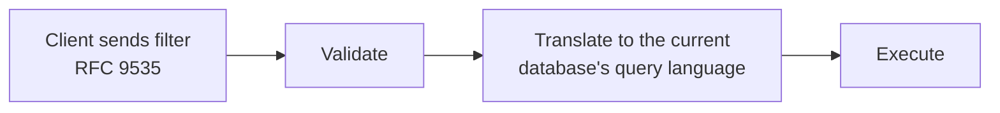

# Design: RFC 9535 JSONPath Filtering with Pluggable Database Translation

**Status:** Under Review
**Service:** `catalog-discover-job` (Beckn Discovr)
**Date:** 2026-06-30

---

## 1. Problem Statement

### How filtering works today

Clients filter catalog resources by sending a JSONPath-like string in
`message.intent.filters.expression`. Discovr doesn't understand this string itself. It just
hands it to PostgreSQL as-is:

- **Validation:** ask Postgres if it can parse the string. If yes, ACK. If no, NACK.
- **Execution:** run the same string against the database, unchanged.

So Postgres decides what's valid, and Postgres is the only thing that ever runs the filter.
Discovr has no independent understanding of the filter itself. This causes two problems:

1. **Clients must write Postgres's dialect, not real JSONPath.** Postgres has its own path
   language (SQL:2016), which looks like RFC 9535 but isn't. RFC 9535 is the actual
   JSONPath standard. A filter written correctly in RFC 9535 gets rejected today, and vice
   versa (see §3 for examples).
2. **The system is locked into Postgres.** Validation and execution both run on the exact
   same Postgres string. Adding or switching to a different engine (Elasticsearch, etc.)
   would mean rebuilding filtering from scratch, breaking every existing client filter.

---

## 2. Goals

1. **Let clients use real RFC 9535 JSONPath**, not Postgres's dialect.
2. **Keep backward compatibility.** Filters already written in Postgres's dialect must
   keep working.

---

## 3. Design

### High-level flow

Each step is explained below.

### Validation

Validation has two jobs: confirm the filter is well-formed RFC 9535, and confirm the
current database can actually run it. It happens in three steps, all before the request is
acknowledged:

1. **Is it valid RFC 9535?** A syntax check against the RFC 9535 grammar.
2. **Can Postgres actually run it?** Some valid RFC 9535 filters still have no way to run
   on Postgres (see §4). Checking this means attempting the translation itself, so this
   step and the Translator (below) are the same piece of work.
3. **Does Postgres actually accept the translated query?** One last live check against the
   real database, to catch anything the first two steps missed.

If all three pass, the request is acknowledged (ACK) and queued. If any fails, it's
rejected (NACK).

The syntax check (step 1) is done with **ANTLR4**, a widely used parser generator: given a
formal grammar for RFC 9535, it generates a parser for that grammar automatically, instead
of one being hand-written from scratch. Hand-writing a parser for a grammar this size is
slow to build and easy to get subtly wrong; ANTLR4 is a standard, well-tested tool for
exactly this problem. On its own, this only checks *format*: is the string valid RFC 9535
syntax. It says nothing about whether Postgres can run it, which is why steps 2 and 3
exist.

### Translator

**Input:** a filter already confirmed to be valid RFC 9535 syntax (from validation step 1).
**Output:** an equivalent query string in the current database's own query language.

Example:
- Input: `$.resources[?(@.category == 'BEVERAGES')]`
- Output (Postgres dialect): `$.resources ?(@.category == "BEVERAGES")`

A search for an existing library that already does "read RFC 9535, output a query in
another language" turned up nothing. Every RFC 9535 library found only evaluates the filter
in memory against JSON already loaded; it doesn't emit another query language. So the
translator is hand-built, walking the same structure ANTLR4 produces during validation
using the **visitor pattern**, a standard way of walking a tree-shaped structure and doing
something at each piece. For each piece of the filter, it emits whatever Postgres needs. A
few examples:

| Feature | RFC 9535 | Postgres |
| :--- | :--- | :--- |
| Filter selector | `[?(@.price < 10)]` | `? (@.price < 10)` |
| String quotes | single or double | double only |
| Existence check | `[?(@.details)]` | `exists(@.details)` |
| Regex | `match(@.name, 'regex')` | `@.name like_regex "regex"` |
| Array index | `[0]`, `[-1]` | `[0]`, `[last]` |

**Not everything can be translated.** Some valid RFC 9535 filters have no Postgres
equivalent at all (e.g. recursive descent, `count()`, negative slice steps). Rather than
guess at a partial translation, these are rejected. See §4 for the full list.

### Execution

**Input:** the translated query string from the Translator, exactly as it was validated
(never re-translated).

**How it runs:** the translated string is passed to the database as a **bind parameter**,
never pasted directly into the SQL text. This is what prevents SQL injection: the database
always treats it as a value to match against, never as code to run. Execution simply reuses
this parameterized query, so a filter can't behave differently at execution time than it
did during validation.

---

## 4. Challenges with the Proposed Design

### Some RFC 9535 features just don't map to Postgres

| RFC 9535 feature | Why Postgres can't do it |
| :--- | :--- |
| Recursive descent (`..`) | Postgres's closest match gives duplicates in a different order, which is the wrong result. |
| Wildcard on unknown type (`.*`) | RFC's wildcard works on objects and arrays; Postgres's only works on objects. |
| Filtering the root itself (`$[?…]`, `$[0]`) | Postgres treats the root as one value, not a list to iterate. |
| Comparing two paths (`@.a == @.b`) | RFC's equality rules here aren't reproducible in Postgres. |
| Existence check on multiple matches (`@.tags[*]`) | Postgres's existence check behaves differently once more than one match is possible. |
| `count()` | RFC counts nodes matched. Postgres's closest function counts array length, which isn't the same thing. |
| Slice with a step, or negative step (`[::2]`, `[::-1]`) | Postgres only supports a plain, continuous range. |
| A few regex features (e.g. Unicode classes) | Postgres's regex engine doesn't support them. |

These are mostly edge cases. Normal Beckn filters (equality, ranges, AND/OR, checking
fields across catalogs, resources, and offers) all work fine.

### If it can't be translated, it's rejected, never guessed

When a filter can't be faithfully translated, the service sends a clear NACK instead of
trying a partial or "close enough" translation. A client either gets a correct result, or a
clear "not supported." Never a silently wrong answer.

An alternative was considered: filtering results in application code instead of in the
database, for the cases Postgres can't handle. This was ruled out because the filter
usually narrows the result set the most. Skipping it in the database query would mean
pulling a huge, unfiltered result set into memory first, which isn't practical at scale.

### Tested against the official spec, not just claimed

The translated queries are run against the official JSONPath Compliance Test Suite and
compared to the expected output:

- Everything currently accepted and run gives the exact right answer. No wrong results.
- **Known gap:** a small number of inputs that the spec says are invalid are currently
  accepted instead of rejected (the parser is a bit too lenient in some edge cases). This
  doesn't cause wrong answers on valid queries, but it's a gap that should be closed.

---

## 5. Benefits of the Proposed Design

- **No lock-in to Postgres.** Since the front end doesn't know about Postgres, and all
  Postgres-specific logic is behind one swappable piece, adding another engine later
  (Elasticsearch, etc.) means writing one new piece, not a rewrite.
- **Bad filters fail fast.** Clients get a clear NACK immediately, instead of the request
  silently failing later in async processing.
- **RFC 9535 compliance can be proven, not just claimed.** Because it uses a real grammar
  instead of ad hoc string matching, it can be run against the official compliance test
  suite and the results shown.
