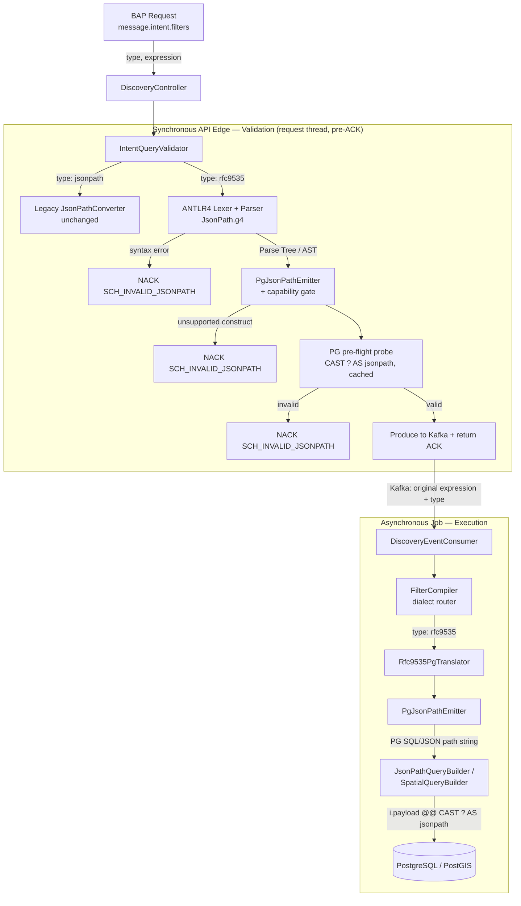

# Technical Design: RFC 9535 JSONPath → Native Database Query Translation Service

**Status:** Under Review
**Service:** `catalog-discover-job` (Beckn Discovr) — `org.beckn.discover.filter`
**Audience:** Architecture review, backend engineering, protocol/spec maintainers
**Last updated:** 2026-06-30

> Companion to `RFC9535_JSONPATH_TRANSLATION_DESIGN.md`. This is the full,
> self-contained technical specification grounded in the shipped implementation
> and its official-compliance-suite results.

---

## Table of Contents

1. [Problem Statement & Engine Coupling](#1-problem-statement--engine-coupling)
2. [Proposed Architecture & Component Pipeline](#2-proposed-architecture--component-pipeline)
3. [Dialect Syntax Comparison](#3-dialect-syntax-comparison)
4. [Challenges, Limitations & Failure Analysis](#4-challenges-limitations--failure-analysis)
5. [Validation Flow](#5-validation-flow)
6. [Compliance Evidence (Official RFC 9535 CTS)](#6-compliance-evidence-official-rfc-9535-cts)
7. [Backward Compatibility & Rollout](#7-backward-compatibility--rollout)

---

## 1. Problem Statement & Engine Coupling

### 1.1 The standards mismatch

Beckn Discovr lets a BAP filter catalog resources by supplying a path expression in
`message.intent.filters.expression`. The service advertises this as "JSONPath," but
the dialect it actually accepts and executes is **PostgreSQL SQL/JSON path**, the
path language introduced by the **SQL:2016 standard (ISO/IEC 9075-2)** and
implemented by PostgreSQL 12+ as the `jsonpath` type.

That is **not** the same language as **RFC 9535 — JSONPath: Query Expressions for
JSON** (IETF, February 2024), the canonical, vendor-neutral standard a client finds
when they search "JSONPath" or use an online JSONPath evaluator.

The two share a surface resemblance (`$`, `.`, `[...]`, `@`) but **diverge on nearly
every non-trivial construct** — filter selector notation, recursive descent, string
quoting, regex flavor, and comparison semantics (see
[§3](#3-dialect-syntax-comparison)). They originate from different standards bodies
with different goals:

| | RFC 9535 JSONPath | PostgreSQL SQL/JSON path |
| :--- | :--- | :--- |
| Standards body | IETF | ISO/IEC (SQL committee) |
| Document | RFC 9535 (2024) | SQL:2016 / SQL:2023 (ISO/IEC 9075-2) |
| Designed for | Standalone JSON querying | Embedding inside SQL statements |
| Filter selector | `$.a[?@.p < 10]` | `$.a ? (@.p < 10)` |
| Regex flavor | I-Regexp (RFC 9485) | POSIX / XQuery `like_regex` |

> The PostgreSQL manual itself traces its dialect to the SQL standard
> ("*SQL/JSON path expressions ... follow the SQL standard*"), **not** to any IETF
> RFC — confirming these are independent lineages, not versions of one language.

**Consequence for clients:** today a BAP must learn and emit a *proprietary
PostgreSQL dialect* to use Discovr's filter feature. This violates the open-network
premise of Beckn — protocol consumers should write to a published standard, not to
the network's current storage engine.

### 1.2 Database coupling risks

The filter capability is welded to PostgreSQL in three places:

1. **Execution** — the expression is wrapped in `i.payload @@ CAST(? AS jsonpath)`,
   a PostgreSQL-only operator over a PostgreSQL-only type.
2. **Validation** — a candidate expression is validated by asking a **live
   PostgreSQL** to parse it (`CAST(? AS jsonpath)`). PostgreSQL *is* the grammar
   authority.
3. **Routing** — the JSONPath filter only ever runs on the PostgreSQL path; the
   Elasticsearch routes push the filter *down* to PostgreSQL via a chain step.

If Discovr ever migrates storage (Elasticsearch, Cassandra, OpenSearch) or routes
filters to a search engine, **the entire filter feature — validation included —
breaks.** There is no abstraction seam between "what the client asked for" and "how
this database answers it."

### 1.3 Why no off-the-shelf library solves this

A survey of the JVM ecosystem found **no production-ready library that translates
RFC 9535 into a database query**:

| Library / Engine | RFC 9535 compliant? | Exposes an AST? | Translates to DB query? | Verdict |
| :--- | :--- | :--- | :--- | :--- |
| **Jayway JsonPath** (`com.jayway:json-path`) | No — pre-RFC Goessner dialect | No — internal evaluator | No | In-memory evaluator only; no AST to translate |
| **Jackson `JsonNode.at()`** | No — JSON Pointer (RFC 6901) | N/A | No | Navigation only; no filters/wildcards |
| **JMESPath** (`io.burt:jmespath`) | No — different spec entirely | Yes | No | Wrong query language |
| Native DB drivers | N/A | N/A | Proprietary only | Accept only DB-native syntax |

Three structural reasons explain the gap:

- **Semantic mismatch.** JSONPath is hierarchical, schema-less nodelist traversal;
  databases are flat relations with JSON columns as an extension. Mapping a dynamic
  path filter to a database query requires engine-specific operators and is not a
  generic, reusable transform.
- **Dynamic query complexity & injection risk.** Naively turning a user string into
  a query risks SQL injection and engine crashes (e.g. regex denial-of-service).
  General-purpose libraries avoid emitting queries precisely to avoid owning these
  vectors.
- **The "evaluator vs. translator" trap.** Almost every JSONPath library is an
  *evaluator* (`read(document, path) → matches`). Translation needs a **walkable
  AST**, which evaluators do not expose.

**Conclusion:** to accept standard RFC 9535 at the edge while executing on
PostgreSQL (and later other engines), the service must own a lightweight
**parser + compiler** built on **ANTLR4** (grammar transcribed from the RFC 9535
ABNF, Appendix A) and the **Visitor pattern**, behind a **pluggable translator
SPI**.

---

## 2. Proposed Architecture & Component Pipeline

### 2.1 Two seams, one neutral AST

The design cuts the monolithic "munge-and-run-on-PG" step into a **front end** (which
dialect did the client write?) and a **back end** (which database are we hitting?),
joined by a **database-neutral Abstract Syntax Tree (AST)**.



If Mermaid is unavailable, the same flow as ASCII:

```
 BAP request (filters.type, filters.expression)
        │
        ▼
 DiscoveryController ──► IntentQueryValidator
        │                       │
        │      type=jsonpath ───┴──► legacy JsonPathConverter (unchanged)
        │      type=rfc9535
        ▼
 [Tier 1] ANTLR Lexer/Parser ──► syntax error ──► NACK
        │ parse tree (AST)
        ▼
 [Tier 2] PgJsonPathEmitter ──► unsupported  ──► NACK
        │ PG SQL/JSON path string
        ▼
 [Tier 3] PG pre-flight probe (cached) ── invalid ──► NACK
        │ valid
        ▼
   produce {type, expression} to Kafka ──► ACK
        │
        ▼ (async)
 DiscoveryEventConsumer ──► FilterCompiler ──► Rfc9535PgTranslator ──► PgJsonPathEmitter
        │                                                                    │
        ▼                                                                    ▼
 JsonPathQueryBuilder / SpatialQueryBuilder ──► i.payload @@ CAST(? AS jsonpath) ──► PostgreSQL
```

**Key architectural decisions:**

- **Kafka carries the *original* expression + `type`, not the translated SQL** — so
  the queued message stays database-agnostic; translation happens at the job, where
  the active engine is known.
- **The same parser + emitter beans serve both the validator (edge) and the consumer
  (job)** — one definition of "valid" and "how it translates," so validation and
  execution can never disagree.
- **Dialect is selected by `message.intent.filters.type`** — `jsonpath` (legacy
  PostgreSQL dialect, unchanged) or `rfc9535` (the standard, new).

### 2.2 Component definitions — inputs, process, outputs

#### Component 1 — ANTLR Lexer & Parser (front end)

| | |
| :--- | :--- |
| **Class** | Generated from `src/main/antlr/JsonPath.g4` → `JsonPathLexer`, `JsonPathParser` |
| **Input** | Raw RFC 9535 expression `String` |
| **Process** | Tokenizes, then parses against the RFC 9535 grammar (transcribed from the RFC ABNF). A custom `ThrowingErrorListener` fails fast on the first syntax error (no error recovery). |
| **Output** | An ANTLR `ParseTree` (the DB-neutral AST), **or** `FilterParseException` if the input is not valid RFC 9535 |

```
Input : $.catalogs[*].resources[?(@.resourceAttributes.category == 'BEVERAGES')]

Output (parse tree, abbreviated):
 jsonpath
 └─ segments
    ├─ childSegment .catalogs            (dotMember)
    ├─ childSegment [*]                  (childBracketed → wildcard)
    ├─ childSegment .resources           (dotMember)
    └─ childSegment [ ? (...) ]          (childBracketed → filterSelector)
       └─ logicalExpr
          └─ comparisonExpr
             ├─ comparable @.resourceAttributes.category   (singularQuery)
             ├─ compareOp  ==
             └─ comparable 'BEVERAGES'                      (string literal)
```

#### Component 2 — Visitor / Emitter (`PgJsonPathEmitter`)

| | |
| :--- | :--- |
| **Class** | `PgJsonPathEmitter extends JsonPathBaseVisitor<String>` |
| **Input** | The ANTLR `ParseTree` |
| **Process** | Recursively walks the tree, emitting the PostgreSQL SQL/JSON path equivalent per node. Applies RFC→PG structural mappings ([§3](#3-dialect-syntax-comparison)). Throws `UnsupportedFilterException` for any node PostgreSQL cannot faithfully express (the **capability gate**). Reconstructs RFC semantics PostgreSQL would otherwise get wrong (e.g. `!=` existence/type guards, string-escape decoding). |
| **Output** | A PostgreSQL SQL/JSON path `String`, **or** `UnsupportedFilterException` |

```
Input  : (parse tree above)
Output : $.catalogs[*].resources ? (@.resourceAttributes.category == "BEVERAGES")
         └ filter selector [?…] → standalone ? (…);  single quotes → double quotes
```

#### Component 3 — Translator SPI (`FilterTranslator` / `Rfc9535PgTranslator`)

| | |
| :--- | :--- |
| **Interface** | `FilterTranslator { String engine(); TranslatedFilter translate(String rfc9535); }` |
| **Input** | RFC 9535 expression `String` + active engine |
| **Process** | Runs the parser, then the engine-specific emitter. Result memoised in a bounded Caffeine cache (translation is a pure function of the input). The SPI is the **pluggable seam**: a new engine = a new `FilterTranslator` bean (e.g. `EsQueryDslTranslator`) over the *same* AST — nothing else changes. |
| **Output** | `TranslatedFilter(String expression, boolean selectionPath)` |

#### Component 4 — Dialect Router (`FilterCompiler`)

| | |
| :--- | :--- |
| **Class** | `FilterCompiler` |
| **Input** | `(expression, filters.type)` |
| **Process** | Routes by dialect: `rfc9535` → `Rfc9535PgTranslator`; `jsonpath`/absent → legacy `JsonPathConverter` (unchanged). Single chokepoint used by **both** the validator and the query builders. |
| **Output** | A PostgreSQL SQL/JSON path `String` |

#### Component 5 — Query Builder (`JsonPathQueryBuilder` / `SpatialQueryBuilder`)

| | |
| :--- | :--- |
| **Class** | `JsonPathQueryBuilder`, `SpatialQueryBuilder` |
| **Input** | PostgreSQL SQL/JSON path `String` (+ schema-context/network filters, limit) |
| **Process** | Wraps the path in an `exists(...)` predicate, binds it as a **single `?` parameter** to `CAST(? AS jsonpath)`, and assembles the full SQL (schema-context pairing, network scoping, ORDER BY, LIMIT). When the path is a node-selection it also projects matched nodes via `jsonb_path_query_array`. |
| **Output** | Parameterized `QuerySpec(sql, params)` executed by `JdbcClient` |

```
Input  : $.catalogs[*].resources ? (@.resourceAttributes.category == "BEVERAGES")
Output : SELECT i.id, i.catalog_id, i.payload ... FROM item i
         WHERE i.payload @@ CAST(? AS jsonpath) ... LIMIT 100
         param = exists($.catalogs[*].resources ? (@.resourceAttributes.category == "BEVERAGES"))
```

### 2.3 End-to-end worked example

**Client sends** (`type: "rfc9535"`):

```json
{
  "message": { "intent": { "filters": {
    "type": "rfc9535",
    "expression": "$.catalogs[*].resources[?(@.resourceAttributes.category == 'BEVERAGES')]"
  } } }
}
```

| # | Boundary | Value crossing the boundary |
| :-- | :--- | :--- |
| 1 | **Controller → Validator** | Raw string + `type = rfc9535` |
| 2 | **Parser output (AST)** | `segments[ .catalogs, [*], .resources, [ ?( @.resourceAttributes.category == 'BEVERAGES' ) ] ]` |
| 3 | **Emitter output (PG path)** | `$.catalogs[*].resources ? (@.resourceAttributes.category == "BEVERAGES")` (`[?…]`→`? (…)`; `'…'`→`"…"`) |
| 4 | **Pre-flight probe** | `SELECT CAST('…' AS jsonpath)` → **OK** (cached) |
| 5 | **ACK** | `{"message":{"status":"ACK","messageId":"…"}}`; original expression + `type` produced to Kafka |
| 6 | **Consumer → FilterCompiler → Translator** | (cache hit) → same PG path string as step 3 |
| 7 | **Query Builder output** | `SELECT … jsonb_path_query_array(i.payload, CAST(? AS jsonpath)) … WHERE i.payload @@ CAST(? AS jsonpath) … LIMIT 100` |
| 8 | **PostgreSQL** | Returns matching resource rows → assembled into `on_discover` catalogs |

A BAP that prototyped this exact expression in any RFC 9535 online evaluator gets
the **same matches** from Discovr — the entire point of standards compliance.

---

## 3. Dialect Syntax Comparison

| Feature | RFC 9535 | PostgreSQL SQL/JSON path | Translation rule (in `PgJsonPathEmitter`) |
| :--- | :--- | :--- | :--- |
| Root / current node | `$` / `@` | `$` / `@` | identical |
| Child member | `.name` / `['name']` | `.name` / `."name"` | bracket-name → quoted dot-accessor |
| Namespaced key | `['schema:price']` | `."schema:price"` | always quote non-identifier members |
| Array wildcard | `[*]` | `[*]` | identical (on arrays) |
| Filter selector | `[?<expr>]` (inline) | `? (<expr>)` (standalone) | the central structural rewrite |
| Comparison ops | `== != < <= > >=` | same | pass-through |
| Logical ops | `&& \|\| !` | `&& \|\| !` | `!` operand parenthesised: `!(…)` |
| Existence test | `[?@.x]` (bare path) | `? (exists(@.x))` | wrap singular path in `exists()` |
| String literals | single **or** double quotes | double quotes only | decode RFC escapes → re-encode as JSON double-quoted |
| Index | `[2]`, `[-1]` | `[2]`, `[last]` | negative index → `last` / `last-n` |
| Slice (positive) | `[1:3]` | `[1 to 2]` | exclusive end → inclusive (`end-1`) |
| Index/slice bound range | full I-JSON (±2^53-1) | 32-bit | out-of-int-range → reject |
| Functions | `length()`, `match()`, `search()` | `.size()`, `like_regex` | mapped (with caveats, §4) |

---

## 4. Challenges, Limitations & Failure Analysis

### 4.1 Expected failure rates

| Query class | Outcome |
| :--- | :--- |
| **Typical Beckn filters** (attribute equality/inequality, numeric ranges, `&&`/`\|\|`/`!`, existence, `match`/`search`, typed-array wildcards `resources[*]`, indices, positive slices, offer queries) | **~0% failure** — fully translated and spec-correct |
| **Structurally divergent RFC constructs** (recursive descent, root-level operations, type-agnostic wildcard, nodelist/deep comparisons, step slices, `count()`) | **Synchronous NACK** — rejected at the edge, never mistranslated, never an async failure |
| **Malformed (non-RFC-9535) input** | **Synchronous NACK** (`FilterParseException`) |

Hard invariant: **the service never returns wrong results for an expression it
accepted.** Anything PostgreSQL cannot faithfully execute is rejected synchronously
rather than guessed — see §4.4.

### 4.2 The regex flavor gap (I-Regexp vs POSIX)

RFC 9535's `match()` / `search()` use **I-Regexp (RFC 9485)** — a small,
deterministic, interoperable regex profile. PostgreSQL's `like_regex` uses a
**POSIX/XQuery** engine. They agree on common patterns (`Fast.*`, `[A-Z]+`,
`\d{3}`), so the overwhelming majority of real filters translate cleanly:

- `match(@.x, "re")` → `@.x like_regex "^(re)$"` (RFC `match` is a *full* match → anchored)
- `search(@.x, "re")` → `@.x like_regex "re"` (RFC `search` is a *substring* match)

**Divergent corners are rejected, not mistranslated:** I-Regexp Unicode property
classes (`\p{Lu}`, `\P{Lu}`) are detected and raise `UnsupportedFilterException`,
because PostgreSQL rejects that escape and a silent rewrite could change matches.

### 4.3 Semantics explicitly corrected to match RFC (not left to PG defaults)

Some constructs *look* translatable but PostgreSQL's default behavior diverges from
RFC. These are reconstructed so results match the spec:

| Construct | RFC behavior | Naive PG behavior | Correction emitted |
| :--- | :--- | :--- | :--- |
| `@.x != v`, `@.x` absent | match (Nothing ≠ value) | drops the row (lax mode) | `(!exists(@.x) \|\| … \|\| @.x != v)` |
| `@.x != v`, `@.x` is a different type | match (type-unequal) | "unknown" → no match | `(… \|\| @.x.type() != "<type>" \|\| @.x != v)` |
| `['\n']`, `['☺']` | member named newline / ☺ | escape dropped → wrong key | RFC-decode, then JSON-re-encode |
| `'abc'` | string `abc` | n/a (single quotes invalid in PG) | re-emit as `"abc"` |

### 4.4 Unsupported expressions (reject-over-guess)

When an expression cannot be faithfully mapped, the emitter raises
`UnsupportedFilterException`, which the edge converts to a synchronous NACK
(`SCH_INVALID_JSONPATH`). It is **never** pushed to Kafka and **never** silently
mistranslated.

| RFC 9535 expression | Why PostgreSQL cannot execute it faithfully | Handling | Correct / alternative approach |
| :--- | :--- | :--- | :--- |
| `$.a[0:0]` | **Empty slice.** RFC permits a zero-length slice. PG `start to end` is *inclusive*; a guaranteed-empty literal subscript (`0 to -1`) isn't representable, and `-1` is not a valid literal subscript. | `UnsupportedFilterException` → NACK | Omit the slice, or use a filter designed to yield no rows. |
| `$.a[0:5:2]` | **Step slicing.** RFC's third slice argument selects every *n*-th element. PG supports only contiguous `start to end`. | rejected in `pgSlice` step check | Query contiguous `[0:5]`, stride in application code. |
| `$.a[::-1]` | **Negative step.** Reverses traversal order. PG paths cannot step backwards. | rejected in `pgSlice` step check | Fetch `[*]` and reverse in the application. |
| `count(@.items)` | **Nodelist count ≠ array length.** RFC `count()` counts *nodes in a nodelist*; PG `.size()` returns an array's element count. For a single (non-array) node, `count()` = 1 while `.size()` differs. Emitting `.size()` would silently return a different number. | rejected in `visitFunctionExpr` | Use `exists(@.items)`, or fetch the array and count in application. |
| `$.a[?@.x, 'name']` | **Mixed selectors in one step.** RFC allows a list combining filters/names/indices. PG bracket lists allow only indices/slices. | rejected in `visitBracketed` | Use successive segments: `$.a[?@.x]['name']`. |
| `$..price` | **Recursive descent.** PG `.**` yields *duplicate* matches, a different ordering, and includes intermediate nodes — materially different from RFC `..` (each node once, document order). | rejected (`visitDescMember` et al.) | Use an explicit path: `$.catalogs[*].resources[*].price`. |
| `$.*` / `$.a.*` | **Type-agnostic wildcard.** RFC `*` selects children of arrays *and* objects. PG `.*` is object-only, `[*]` array-only — neither covers both, and the type isn't known at translate time. | rejected (`visitDotWildcard`) | Use the bracket wildcard on a known array: `resources[*]`. |
| `$[?@.p < 10]`, `$[0]`, `$[*]` | **Operation directly on root.** RFC iterates the root's children type-agnostically; PG `$ ? (…)` tests the root as a whole and lax-wraps scalars. Discovr's payload root is an object `{ "catalogs": […] }`. | rejected (`visitJsonpath` root check) | Begin with a member access: `$.catalogs[*][?@.p < 10]`. |
| `$.a[?@.x == @.y]` | **Path-vs-path comparison.** RFC defines deep/nodelist equality (and both-absent equality) that PG scalar comparison cannot reproduce. | rejected in `visitComparisonExpr` | Compare a path to a literal: `@.x == "value"`. |
| `$.a[?@.b[*]]` | **Non-singular existence test.** RFC allows a wildcard/slice/descendant query as an existence test; PG `exists()` over such a path diverges. | rejected in `visitTestExpr` | Test a singular path: `[?@.b]` or `[?@.b.c]`. |
| `match(@.x, "\p{Lu}")` | **I-Regexp Unicode class.** Valid in I-Regexp; PG `like_regex` rejects the `\p{…}` escape. | rejected in `visitFunctionExpr` | Use an explicit class: `[A-Z]`. |
| `$.a[9007199254740991]` | **Index out of 32-bit range.** RFC allows the full I-JSON integer range; PG subscripts are 32-bit, and such an index addresses no real array. | rejected in `intArg` | Use an in-range index. |

### 4.5 Why this is "Option A" (faithful subset), not a full in-process evaluator

PostgreSQL's path language is a *different language* and cannot reproduce the
constructs above. The alternative — **evaluate RFC 9535 in-process** (fetch
candidate rows, then run a compliant engine in the application) — was rejected: the
filter is usually the *most selective* predicate, so removing it from SQL means
fetching up to the entire scoped corpus (millions of rows at Discovr's 15M-resource
scale target). Capping the fetch would break completeness. The faithful-subset
approach keeps execution in the database, indexed, and **never wrong**; the exotic
constructs it rejects are not used by realistic discovery filters. A bounded
*hybrid* remains a future option if a hard requirement emerges.

---

## 5. Validation Flow

Validation runs **synchronously on the API request thread, before the ACK and before
any Kafka publish** (`IntentQueryValidator`, invoked from `DiscoveryController`).
This guarantees a malformed or unsupported filter becomes a clean protocol **NACK**
(`SCH_INVALID_JSONPATH`) rather than an async failure with no callback. It is a
**three-tier gateway**, mirroring execution exactly so the two can never disagree:

```
expression + type
      │
      ▼
┌──────────────────────────────────────────────────────────────────────┐
│ Tier 1 — Grammar check (ANTLR, DB-neutral)                             │
│   parse against RFC 9535 grammar.  fail → FilterParseException → NACK   │
├──────────────────────────────────────────────────────────────────────┤
│ Tier 2 — Capability check (PgJsonPathEmitter.translate)                │
│   walk AST; unmappable construct → UnsupportedFilterException → NACK    │
├──────────────────────────────────────────────────────────────────────┤
│ Tier 3 — Database pre-flight probe (cache-backed)                      │
│   CAST(<translated> AS jsonpath) on PostgreSQL (parse-only, no table).  │
│   genuine parse failure → NACK.  transient DB error → propagate (5xx).  │
└──────────────────────────────────────────────────────────────────────┘
      │ all tiers pass
      ▼
   produce original expression + type to Kafka  →  ACK
```

- **Tier 1** is database-independent: "is this valid RFC 9535?" — answered by the
  grammar alone, no I/O.
- **Tier 2** is engine-specific: "can the target engine express this?" — the
  capability gate that turns the unsupported set (§4.4) into precise NACKs *before*
  any DB round-trip.
- **Tier 3** is the final authority for the active engine: the translated PG string
  is probed via a **Caffeine-cached** `CAST(? AS jsonpath)`. The first sighting of an
  expression costs one parse-only round-trip; every repeat is a map lookup. Negative
  verdicts are cached too (a client spamming an invalid expression cannot hammer the
  database). A **transient** DB failure is *not* cached and propagates as a 5xx, so a
  database outage never masquerades as "your valid expression is malformed."

For a future non-PostgreSQL engine, Tiers 1–2 are unchanged (grammar +
translator-driven); only Tier 3's probe is engine-bound, supplied per translator.

> **Guarantee:** any expression that passes all three tiers is executable by the
> database and returns spec-correct results — validated empirically in §6.

---

## 6. Compliance Evidence (Official RFC 9535 CTS)

The translator is run **differentially against the official JSONPath Compliance Test
Suite** (`jsonpath-standard/jsonpath-compliance-test-suite`, 703 cases): each case's
selector is translated to PostgreSQL, executed against the case document in a real
PostgreSQL (Testcontainers), and the result is compared (order-insensitive) to the
spec's expected result (`CtsComplianceIT`).

| Metric | Value |
| :--- | :--- |
| Cases accepted **and** executed | 69 |
| **Correct (match the spec)** | **69 / 69 — 100%** |
| **Wrong (mismatch)** | **0** |
| PostgreSQL execution errors | **0** |
| Rejected as unsupported (capability gate) | 386 |
| Invalid selectors correctly rejected | 157 |

The large "unsupported" count is a property of the CTS, which heavily exercises
**root-level** primitives (`$[?…]`, `$[*]`, `$..` directly on the document) that do
not apply to Discovr's `{ "catalogs": [ … ] }` payload shape. The realistic
discovery surface — member-prefixed attribute filters, ranges, equality, logical
operators, functions, and offer queries — is validated by a separate
**525-scenario result-validation suite** (`Rfc9535ComplianceIT`) asserting exact
result sets against an independent Java oracle, also at **100%**.

**Headline claim this evidence supports:** *Discovr supports RFC 9535 for the subset
PostgreSQL can faithfully execute — validated 100%-correct against the official
compliance suite — and rejects (never mistranslates) the constructs it cannot.*

---

## 7. Backward Compatibility & Rollout

- **Dialect discriminator:** `message.intent.filters.type`. `jsonpath`/absent → the
  legacy PostgreSQL dialect, byte-for-byte unchanged (every existing client and
  fixture keeps working). `rfc9535` → the new standard path. This is the only
  behavioral switch; the legacy code path is untouched.
- **Spec dependency:** `filters.type` is an `enum` in `beckn.yaml`. Enabling
  `rfc9535` end-to-end requires an **additive** enum extension
  (`enum: [jsonpath, rfc9535]`); existing requests remain schema-valid. Until that
  ships, `rfc9535` is rejected at schema validation — legacy traffic unaffected.
- **Pluggability:** a second engine (Elasticsearch, Cassandra) is added by
  registering a new `FilterTranslator` bean over the same AST and supplying its
  Tier-3 probe — no change to the grammar, the edge, or the Kafka contract.
- **Rollout phases:** (0) spec enum; (1) front end + edge validation; (2) PG
  translator + execution (this design); (3) future engines / regex hardening as
  scoped follow-ups.

---

### Appendix — Source map

| Concern | Class |
| :--- | :--- |
| Grammar | `src/main/antlr/JsonPath.g4` |
| Parser front end + cache | `filter/rfc9535/Rfc9535PgTranslator.java` |
| RFC→PG visitor | `filter/rfc9535/PgJsonPathEmitter.java` |
| Fail-fast parse errors | `filter/rfc9535/ThrowingErrorListener.java` |
| Translator SPI | `filter/FilterTranslator.java`, `filter/TranslatedFilter.java` |
| Dialect router | `filter/FilterCompiler.java` |
| Exceptions | `filter/FilterParseException.java`, `filter/UnsupportedFilterException.java` |
| Edge validation (3-tier) | `service/validation/IntentQueryValidator.java` |
| Query builders | `service/postgresql/jsonpath/JsonPathQueryBuilder.java`, `service/postgresql/spatial/SpatialQueryBuilder.java` |
| Official CTS differential test | `test/.../filter/rfc9535/scenarios/CtsComplianceIT.java` |
| 525-scenario result validation | `test/.../filter/rfc9535/scenarios/Rfc9535ComplianceIT.java` |
