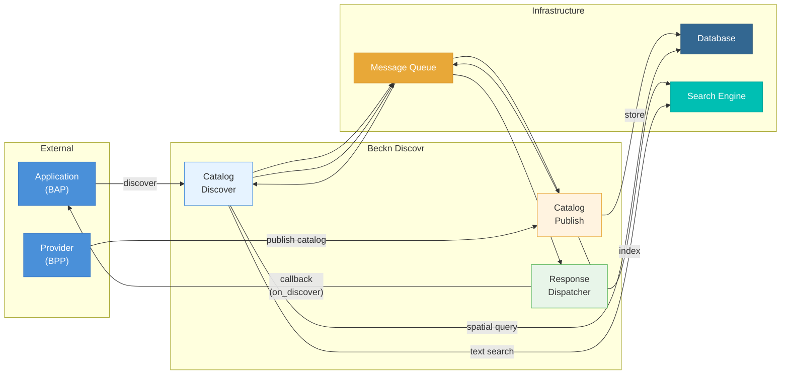

# Beckn Discovr — Architecture

## How it works

### Publishing a Catalog
A **Provider (BPP)** publishes its catalog to Discovr. The data is stored in a **Database** and indexed in a **Search Engine** for fast lookups.

### Discovering a Catalog
An **Application (BAP)** sends a discover request. Discovr searches using spatial queries (Database) and text search (Search Engine), then sends the results back to the application via an asynchronous callback.

All communication between services is decoupled through a **Message Queue**.
