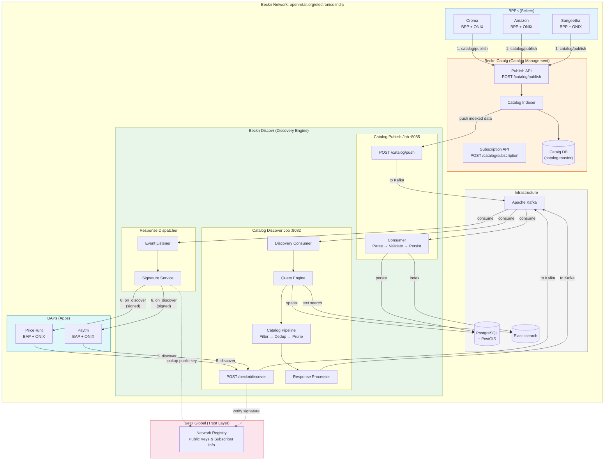
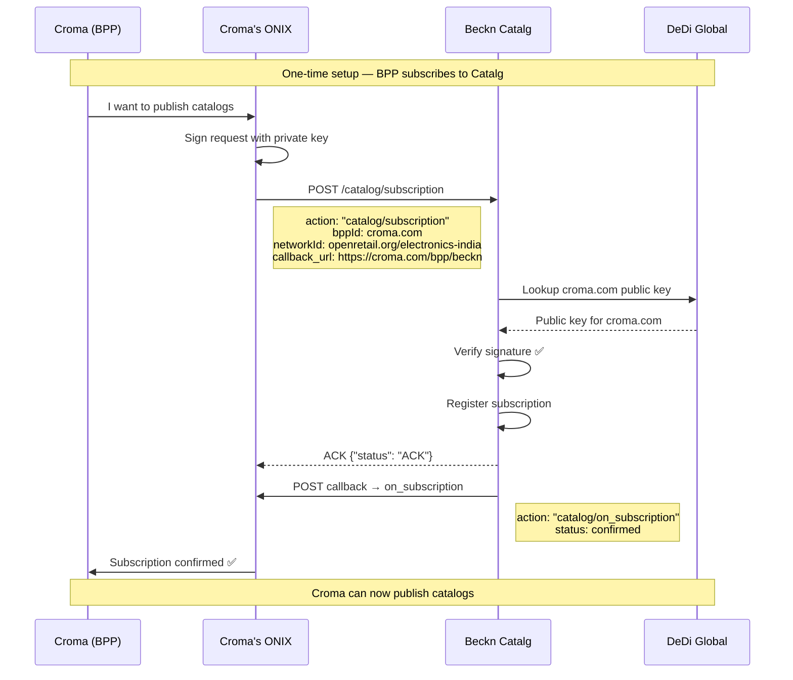
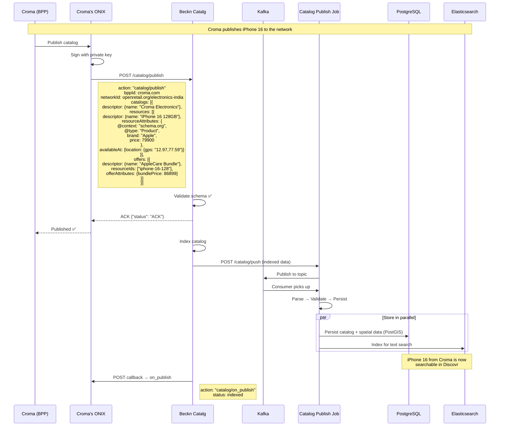
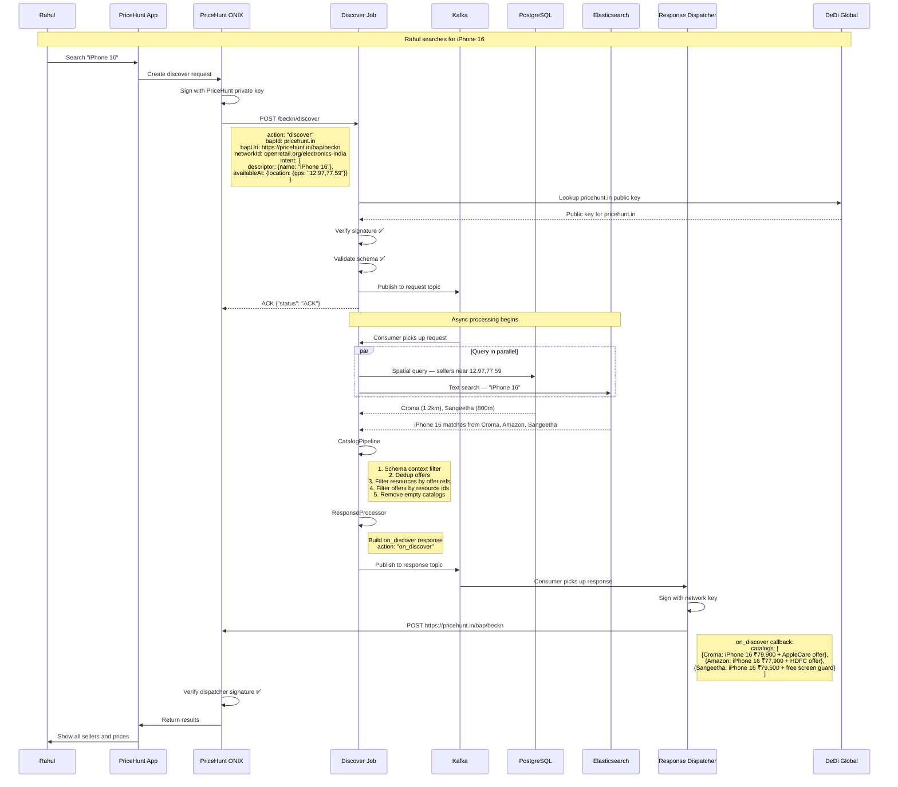
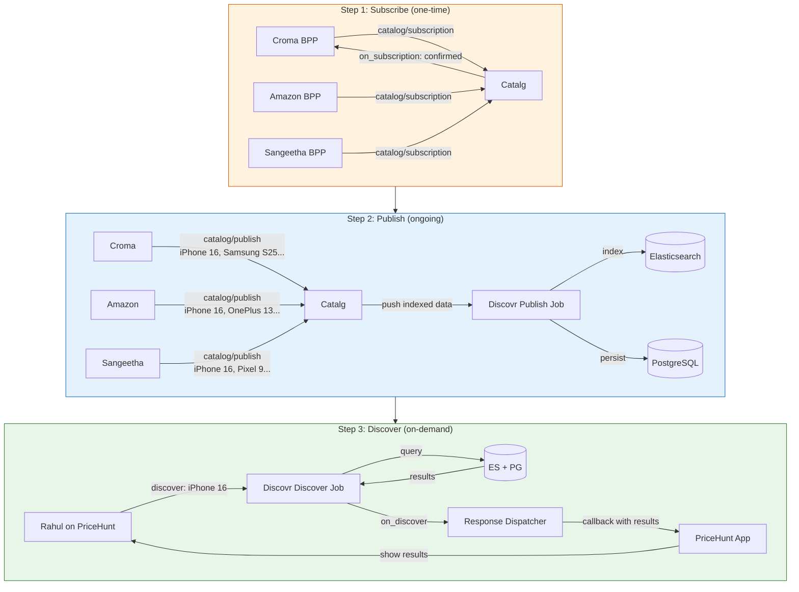
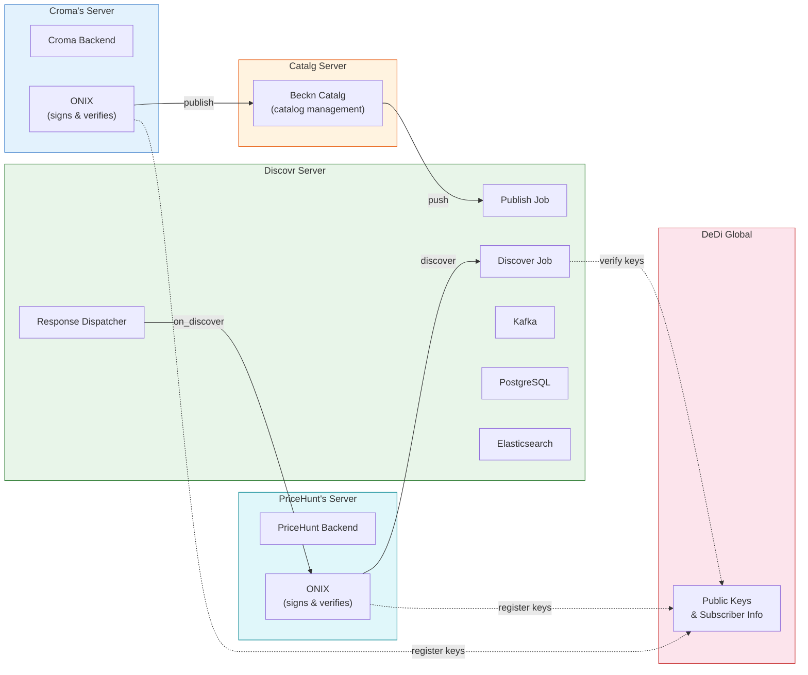

# Beckn Catalog & Discover — Complete Architecture

## The Big Picture

---

## Flow 1: Subscription (BPP registers with Catalg)

**"Hey Catalg, I want to publish catalogs to the network"**

---

## Flow 2: Catalog Publish (BPP pushes products)

**"Here are my products — iPhones, Samsung phones, etc."**

---

## Flow 3: Discover (BAP searches for products)

**"User wants iPhone 16 near Koramangala"**

---

## Flow 4: All Three Together (Timeline)

---

## Data Flow Summary

| Step | Action | From | To | What happens |
|------|--------|------|----|-------------|
| 1 | `catalog/subscription` | BPP → Catalg | One-time | BPP registers to publish catalogs |
| 2 | `catalog/on_subscription` | Catalg → BPP | Callback | Confirms subscription |
| 3 | `catalog/publish` | BPP → Catalg | Ongoing | BPP sends product catalogs |
| 4 | Internal push | Catalg → Discovr Publish Job | Internal | Indexed data pushed to Discovr |
| 5 | Persist + Index | Publish Job → PG + ES | Internal | Stored for spatial + text queries |
| 6 | `catalog/on_publish` | Catalg → BPP | Callback | Confirms publish success |
| 7 | `discover` | BAP → Discovr | On-demand | User searches for products |
| 8 | Query | Discovr → PG + ES | Internal | Spatial + text search across all catalogs |
| 9 | Pipeline | Internal | Internal | Filter, dedup, prune results |
| 10 | `on_discover` | Dispatcher → BAP | Callback | Signed results sent to BAP |

---

## Where Each System Lives

