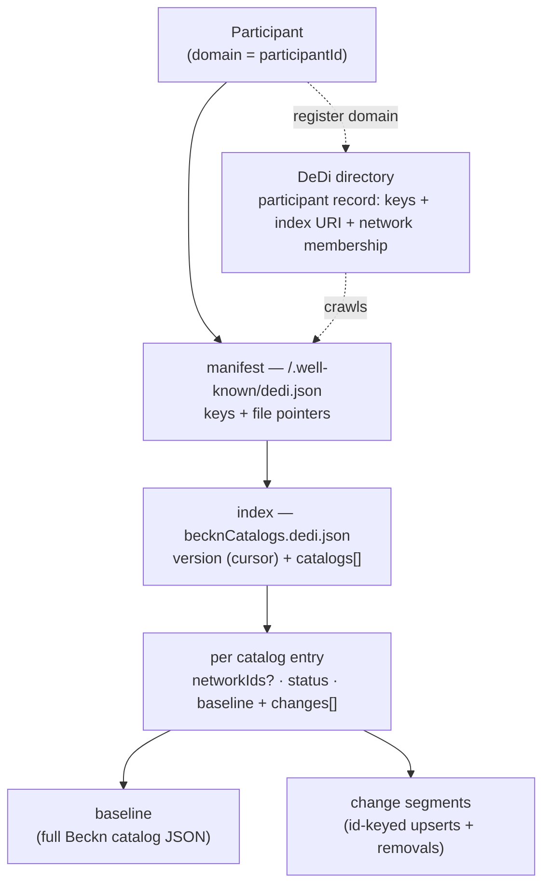
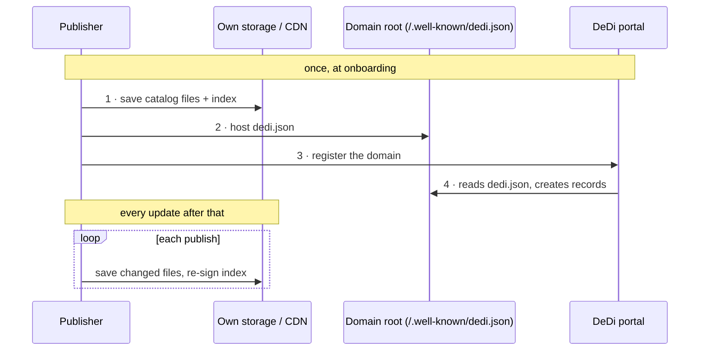
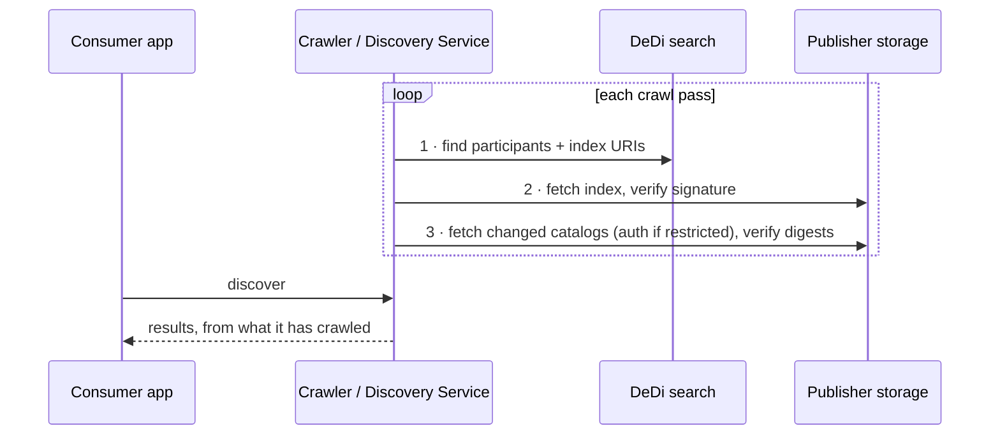
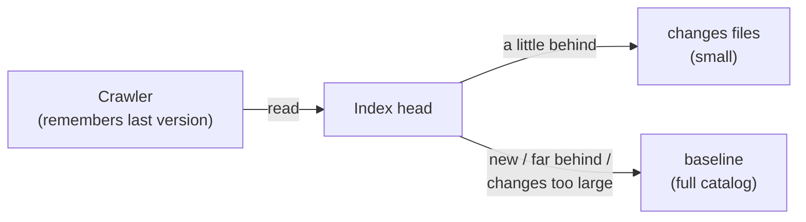
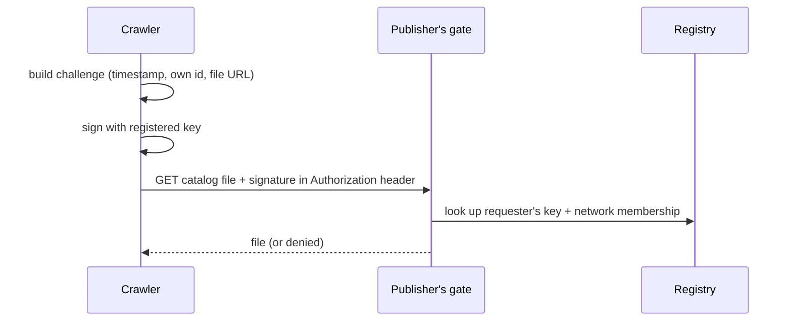

# Decentralized Catalog — Design & Specification

Consolidated working design for **decentralized catalog publishing and discovery**. It combines
two notes — the *Publishing and Discovery Flows* design and the *Catalog Incremental Updates*
research note — into one document; nothing from either is dropped.

## Overview & reading guide

**How to read this:**
- **Understand the system** → §1 Context & principles, §2 Data model, §3 Flows.
- **Build to it** (publisher or crawler) → §4 Interface & contract.
- **Question the decisions** (why the change feed, why not Git) → §6 Rationale & alternatives.

**What's inside:** 1 Context & principles · 2 Data model · 3 Flows · 4 Interface & contract ·
5 Summary · 6 Rationale & alternatives · 7 Open questions · Appendix A — Tooling.

**Status / assumption:** the DeDi portal and search behaviour described here is our working
assumption of how DeDi flows will operate, to be validated with the DeDi team (see §7).

**Field-name note:** the file examples in §4 are reproduced from the research note (illustrative,
not normative) and keep its original names. §1–§3 are authoritative where they differ —
`subscriberId` → `participantId` (= domain), and access is expressed as `networkIds` (absent =
public) + an auth-method entry.

---

# 1. Context & principles

## 1.1 Problem & scope

Publishers should be able to publish catalogs on **their own infrastructure** and have them
discovered across the network **without a central catalog host**, and without consumers ever
trusting data they cannot verify. Updates should be **cheap**: a consumer that already holds a
catalog should fetch only what changed, not the whole thing again.

**Goals:** decentralized hosting; identity from domains; end-to-end verifiability; incremental,
low-egress updates.

**Non-goals:** no central catalog server or dynamic backend (everything is static files behind a
CDN); no multi-writer merging (each catalog has exactly one authoritative publisher); no
dependency on a specific filesystem or on Git.

## 1.2 Actors

| Actor | Role |
|-------|------|
| **Publisher (participant)** | Hosts the catalog files, the index, and `dedi.json` on its own storage/CDN. Registers its domain with DeDi. Signs its index; gates restricted downloads. |
| **DeDi** | A decentralized **directory**, not a catalog host. Portal registers a domain and crawls its `dedi.json`; search returns participants and their index URIs; the registry holds keys + network membership used to authorize restricted downloads. |
| **Crawler / Discovery Service** | Consumer-side reader. Finds participants via DeDi, fetches and verifies indexes and catalog files, and serves consumers through the `/discover` API. |
| **Consumer app** | Calls `/discover`; sees results from what the crawler has already gathered. |

## 1.3 Principles (invariants)

Every mechanic below follows from these:

1. **No central catalog server.** Catalogs are static files on the publisher's own storage; DeDi
   holds only pointers and keys.
2. **Identity = domain.** `participantId` is the domain; uniqueness comes from DNS, not a
   registry. Subdomains are independent participants.
3. **Verify before trust.** The index is signed by the publisher's registered key; every
   referenced file is verified against its digest in the signed index.
4. **Immutable, content-addressed files.** Baselines and change segments never change once
   published, so CDNs cache them forever.
5. **Digests are the change signal** — not timestamps. An unchanged file has an unchanged digest;
   `updatedAt` is a convenience only.
6. **Incremental by default.** A catalog is a baseline plus append-only change segments; a crawler
   resumes from a stored version cursor and fetches only what is new.
7. **One authoritative publisher per catalog.** No multi-writer conflict resolution is needed.
8. **Pull-based discovery.** Crawlers pull on their own schedule; there is no push and no
   application server in the path.

---

# 2. Data model

A participant publishes a small hierarchy of static files. Each layer points to the next and
carries the digest of what it points to, so the whole chain is verifiable from the signed index
down.



- **Participant** — a domain. Its identity, keys, and index URI live in a **DeDi record** created
  when the domain is registered.
- **Manifest** (`/.well-known/dedi.json`) — the fixed entry point on the domain; names the keys
  and points to one index per use case (catalogs today, others later).
- **Index** (`becknCatalogs.dedi.json`) — the signed, versioned list of catalogs. `version` is the
  monotonic sequence a crawler uses as its cursor.
- **Catalog entry** — per catalog: identity, status, optional `networkIds` (access), and a
  **baseline** + list of **change** segments.
- **Baseline / change segments** — the actual data: a full catalog file, plus immutable per-publish
  deltas keyed by resource id.

---

# 3. Flows

## 3.1 Publishing

A publisher does three things once, and one thing on every update.

**Once, at onboarding:**
1. Put the catalog files and the index (`becknCatalogs.dedi.json`) on any storage it already has
   — an object store, a CDN, a static site.
2. Put `dedi.json` at the fixed path on its domain: `techmart.com/.well-known/dedi.json`. This
   file names its keys and points to the index.
3. Go to the DeDi portal and enter the domain. DeDi crawls `dedi.json` from the fixed path,
   creates the participant's records, and the index URI becomes available to the network.

**On every update:** save the changed catalog files, update the index, re-sign it. Nothing else
— DeDi is not touched, the domain file is not touched, no API is called.



## 3.2 Discovery

A crawler (a Discovery Service, or any consumer node doing its own reading) works in three steps:

1. Ask DeDi's search for participants and their catalog records — this yields each participant's
   index URI.
2. Fetch the index, verify its signature against the participant's registered key, and see what
   changed since the last visit.
3. Fetch only the changed catalog files, verify each against its digest in the index, and serve
   consumers through the unchanged `/discover` API.

If a catalog (or the index itself) is restricted, the crawler authenticates for the download —
same method either way (§3.4).



## 3.3 Incremental updates — baselines, changes, compaction

Each catalog in the index carries a **baseline** (the latest full file) and a list of **changes**
files — one per publish, each holding just the added/updated resources and the ids of removed
ones. All are immutable files with digests in the index. A crawler remembers the last version it
applied:

- Slightly behind → fetch only the changes files after its version.
- New, or too far behind → fetch the baseline, then the changes after it.
- If the pending changes add up to a large share of the baseline (say a quarter), fetch the
  baseline instead — it's cheaper.



**Compaction (a baseline change).** Changes files must not pile up forever. When the list grows
long — or on a simple schedule, say weekly — the publisher folds everything into a fresh
baseline: publish the new full file at a new URL, point the index's `baseline` at it, and start
the `changes` list again from there. Old baseline and old changes files stay available for a
grace period (long enough for the slowest expected crawler), then are deleted.

**A crawler needs no special handling for compaction.** Its rule is already complete: if the
changes it needs are listed, take them; otherwise take the baseline. A crawler that shows up
mid-compaction sees either the old consistent set or the new one — never a mix, because every
file it takes is verified against the digests in the one signed index it read.

**Tools publishers have today.** The changes file is a diff between two versions of a JSON file —
off-the-shelf tools compute exactly this (`jd`, `jsondiffpatch`, both able to match array items
by id). Publishers who keep their catalog in git get the history for free and script the rest.
The provider publish tool does all of this automatically (§4.7); Appendix A lists the off-the-shelf
building blocks.

## 3.4 Visibility and access — who may read a catalog

Both live in the index, per catalog:

- **Visibility:** a catalog may list `networkIds` it is meant for. No `networkIds` present →
  **public by default**.
- **Auth method:** the same entry names how a restricted catalog's download must be
  authenticated.

The first proposed method follows Beckn Auth: a **signed challenge**. The challenge is built from
a few fixed variables the crawler can work out on its own — current timestamp, its own
participantId, the file URL — so no round trip is needed to obtain it. The crawler signs the
challenge with its network-registered key and sends the signature in the `Authorization` header
of the download request. The publisher's gate verifies the signature against the requester's key
in the registry and checks the requester belongs to a permitted network.



The challenge is **one** method, not the only one — the index's auth entry is a list, so others
(signed URLs, mTLS, token-based) can be added without changing the shape. What enforces the gate
on the publisher's side — ONIX, the provider adapter, a CDN rule — is deliberately left open for
now.

The **index itself can be private** the same way: its entry in DeDi carries the auth method, and
a crawler authenticates to fetch it exactly as it would for a catalog file. One mechanism covers
both.

---

# 4. Interface & contract

The concrete surface an implementer builds to: the three published files, the DeDi integration,
and the verification rules. The file examples are reproduced from the research note (illustrative,
not normative); per §1–§3, `subscriberId` becomes `participantId` (= domain) and access is
expressed as `networkIds` (absent = public) + an auth-method entry.

## 4.1 The manifest — `techmart.com/.well-known/dedi.json`

Written once at onboarding; one pointer per use case the domain publishes (catalogs today, rego
policies tomorrow). Never touched by the publish pipeline.

```json
{
  "subscriberId": "bpp.techmart.com",
  "keys": [
    { "id": "bpp.techmart.com|key-001", "publicKey": "…" }
  ],
  "files": [
    { "name": "becknCatalogs",
      "url": "https://cdn.techmart.com/beckn/becknCatalogs.dedi.json" }
  ],
  "updatedAt": "2026-01-05T00:00:00Z"
}
```

## 4.2 The index — `becknCatalogs.dedi.json`

Re-signed on every publish; `version` is the monotonic sequence a crawler uses as its cursor. Each
catalog entry carries the latest full **baseline** plus the **changes** segments published since
it. A retired catalog stays as a tombstone entry.

```json
{
  "subscriberId": "bpp.techmart.com",
  "version": 42,
  "updatedAt": "2026-07-22T09:00:00Z",
  "validUntil": "2026-07-29T09:00:00Z",
  "catalogs": [
    {
      "catalogId": "bpp.techmart.com/electronics-2026",
      "catalogType": "REGULAR",
      "status": "ACTIVE",
      "visibility": "public",
      "updatedAt": "2026-07-22T09:00:00Z",
      "schemaTypes": ["https://schema.beckn.org/retail/schema/1.1.0/context.jsonld"],
      "baseline": {
        "version": 40,
        "url": "https://cdn.techmart.com/beckn/electronics-2026.v40.json",
        "digest": "…"
      },
      "changes": [
        { "version": 41,
          "url": "https://cdn.techmart.com/beckn/electronics-2026.v41.changes.json",
          "digest": "…" },
        { "version": 42,
          "url": "https://cdn.techmart.com/beckn/electronics-2026.v42.changes.json",
          "digest": "…" }
      ]
    },
    {
      "catalogId": "bpp.techmart.com/electronics-2025",
      "status": "RETIRED",
      "retiredAt": "2026-01-31T00:00:00Z"
    }
  ]
}
```

A crawler whose cursor is 41 fetches only `v42.changes.json`. A crawler at 38 — or a new one —
fetches the v40 baseline plus v41 and v42. If the accumulated changes exceed a set fraction of the
baseline size, it fetches the baseline instead (the apt cutover rule). Every file it touches is
verified against its digest here, and the index itself against the signed key.

## 4.3 A change segment — `electronics-2026.v42.changes.json`

Immutable once published. Upserts carry whole resources keyed by id (never array positions);
removals are ids.

```json
{
  "catalogId": "bpp.techmart.com/electronics-2026",
  "fromVersion": 41,
  "toVersion": 42,
  "upserts": [
    {
      "id": "bpp.techmart.com/item-laptop-xps-15",
      "descriptor": { "name": "Dell XPS 15", "shortDesc": "15-inch developer laptop" },
      "resourceAttributes": { }
    }
  ],
  "removals": ["bpp.techmart.com/item-laptop-xps-13"]
}
```

## 4.4 The catalog baseline — `electronics-2026.v40.json`

Exactly the plain Beckn catalog JSON of the main design, unchanged — the same schema that goes
over `catalog/publish` today. The feed never alters the catalog format; it only adds a cheaper way
to learn what changed inside it.

## 4.5 DeDi contract

- **Register (once).** The publisher enters its domain in the DeDi portal. DeDi crawls
  `/.well-known/dedi.json` from the fixed path, creates the participant's records, and the index
  URI becomes available to the network. No per-publish call is ever made to DeDi.
- **Search (each crawl).** A crawler asks DeDi search for participants and their catalog records;
  the result yields each participant's index URI.
- **Registry lookup (restricted downloads).** A publisher's gate resolves a requester's key and
  network membership from the registry to authorize a restricted download (§3.4).

## 4.6 Verification rules

- **Index.** Verify the index's signature against the participant's registered key before trusting
  anything in it. Treat `version` as a monotonic cursor and rollback guard — never accept an index
  whose `version` is lower than the last one accepted.
- **Files.** Before using any baseline or change segment, verify its bytes against the `digest`
  listed in the (now trusted) index. A file that fails is rejected; the last known-good state is
  kept.
- **Reconstruction (optional).** After applying change segments to the baseline in version order,
  a crawler may confirm the result matches the current baseline's declared digest.

## 4.7 Provider tooling (ONIX publish plugin)

A publisher cannot compute diffs, digests, signatures, or run compaction by hand. The design
therefore assumes a **provider-side publish tool** — an ONIX plugin / provider adapter — that does
all of it. The publisher's only manual step stays "save the catalog"; the tool does the rest.

| Command | Input → Output |
|---------|----------------|
| **init / register** | first time → generate keys, write `dedi.json`, register the domain on the DeDi portal |
| **publish** | new catalog version → diff vs current state → write a `changes` segment, hash it, add it to the index, bump `version`, re-sign the index |
| **diff / segment** | two catalog versions → id-keyed `upserts` + `removals` (via `jd` / `jsondiffpatch`) |
| **digest** | any file → content hash, written into the index |
| **sign** | canonically serialize the index → sign with the registered key |
| **compact** | when `changes` grow (by size or on a schedule) → write a fresh `baseline`, repoint the index, restart the `changes` list |
| **retention / GC** | after the grace period → delete superseded baselines and segments |
| **validate** | before going live → digests match, `version` is monotonic, the chain is consistent |

So the day-to-day publish is one call; the plugin runs diff → segment → digest → index → sign, and
compaction on a schedule.

---

# 5. Summary

1. **Identity:** participantId = domain (subdomains are independent participants); no BAP/BPP
   split; uniqueness comes from DNS, not a registry.
2. **Publish:** three one-time steps (host files, host `dedi.json`, register the domain on the
   DeDi portal); after that, publishing = save files + re-sign index. DeDi crawls the fixed path
   itself.
3. **Discover:** DeDi search → index → changed files only; verification against the registered
   key and the index digests at every step.
4. **Incremental:** baseline + immutable changes files inside the existing index; compaction
   folds changes into a fresh baseline on size or schedule; crawlers need no special compaction
   logic.
5. **Access:** visibility (`networkIds`, absent = public) and auth methods live per catalog in the
   index; first method is a signed, self-derivable challenge in the `Authorization` header; the
   private-index case uses the same mechanism via its DeDi entry.

---

# 6. Design decisions & rationale

**Origin:** research input for open question 3 of the design ("Choosing a filesystem — whether Git
or any other filesystem that supports incremental diff"). Four solution families were surveyed in
parallel: Git/version-control transports, HTTP-native delta sync, content-addressed/Merkle
systems, and data-format-level change feeds.

## 6.1 The short answer

What the design needs is not a filesystem — it is a **publishing convention over the static files
we already have**. All four research tracks converged on the same result: the current shape (a
signed index listing immutable parts with digests, plus a relay that carries a version/hash as
the change signal) is already the proven pattern — it is structurally what TUF, the Nix binary
cache, apt, and OpenStreetMap replication all do in production. The only missing piece is *what
the referenced files contain*: today a part is a whole-catalog slice re-emitted on any change; for
incremental updates it should be a **delta segment**.

## 6.2 The recommended mechanism: a static change feed

On each publish, alongside (or instead of) rewriting whole parts, the provider emits one small
**immutable segment file** containing the changes since the previous version — per-resource
**upserts and tombstones, keyed by resource id** (never by array position). The index gains a
monotonic sequence, and each segment appears in it with a URL and digest, exactly like parts do
today.

A crawler stores one number — the last sequence it processed. On its next pass it reads the index
head, fetches only the segments after its cursor, and merges them by id into its own store. A
brand-new or long-absent crawler fetches the most recent **full baseline** plus the tail of
segments after it. The relay change signal stays what it is — the new index version/hash, never
content.

This is the exact mechanism running at planet scale today:

- **OpenStreetMap replication** publishes the entire world's edit stream as numbered diff files on
  plain HTTP — a tiny state file holds the head sequence; consumers replay from their cursor. No
  application server.
- **Debian apt Pdiffs** solve literally our problem — a large index file re-downloaded whole on
  every change — by publishing per-version diff files listed, with digests, in a small index file.

Why it fits us specifically:

- **Smallest possible change.** The index, digests, signature, and relay are untouched; segments
  are just more digested files the index lists.
- **Verification composes for free.** Each segment is covered by its digest in the signed index;
  the crawler can additionally verify that applying the segments yields the declared digest of the
  current catalog.
- **Id-keyed, not positional.** Diffs name the changed products, so the crawler applies them
  without fragile array-index arithmetic (the failure mode of raw JSON Patch on catalogs).
- **Lossless catch-up from any point** via the sequence cursor — the property that
  version-to-version patch chains lack.
- **Egress drops on both sides.** Unchanged catalogs cost one small index poll; changed catalogs
  cost only the changed records.

## 6.3 Rules the detailed design must adopt with it

1. **The apt cutover rule.** If the accumulated delta since a crawler's cursor exceeds some
   fraction of the full catalog, fetch the baseline instead. Bounds the worst case and the
   retention burden.
2. **Retention tiers.** Providers keep segments long enough to cover realistic crawler lag, plus
   periodic fresh baselines; old segments age out (OSM keeps minute/hour/day tiers).
3. **Canonical serialization.** Catalog JSON must be emitted with stable key order and formatting;
   otherwise every publish looks fully changed and every delta mechanism collapses.
4. **Digests over timestamps.** Google's sitemap experience: an inaccurate change hint is worse
   than none. Our per-part/per-segment digests are un-gameable change hints; `updatedAt` stays a
   convenience.
5. **Immutable, content-named files.** Segments and baselines never change once published, so CDNs
   cache them forever and never need invalidation — this is where the egress saving compounds.

## 6.4 Where Git lands

Git was the seed of this question, and it *can* do the job — but only in one specific
configuration. Git's normal efficient fetch ("give me only what's new") requires a smart server
computing pack files per request, which contradicts static hosting; and hosting on GitHub fails
outright at network scale (60 unauthenticated requests/hour per IP, and terms that discourage
CDN-style crawling). The one static-compatible mechanism is **bundle URIs with creation tokens**
(Git ≥ 2.38): the provider publishes a base bundle plus incremental bundles on its own CDN, a
crawler downloads only bundles newer than its token, and the signed index pins the expected tip
commit hash — Git's own hash chain then verifies all content. It genuinely works, and the "latest
commit hash goes to the relay" intuition maps onto it directly.

But it is an off-label use of a feature designed to accelerate clones, not to replace servers; it
requires every crawler to hold a Git repository per provider; and it delivers the same delta
property the change feed delivers with far less machinery. The recommendation is therefore: the
**network standard is the change feed**; Git remains something an individual provider may use
internally to *produce* segments (commit history makes generating them trivial), or an adapter
implementation detail — not a protocol requirement.

## 6.5 Options evaluated and set aside

- **Content-addressed chunk stores** (casync/desync; Hugging Face serves petabytes this way): the
  strongest byte-level alternative, and per-product "semantic chunking" is worth keeping in mind
  if segments ever prove insufficient — but the change feed reaches the same egress result at
  record granularity with simpler provider tooling.
- **TUF** (The Update Framework): not a diff mechanism, but the canonical hardened form of our
  signed index — its consistent-snapshot, rollback-protection, and key-rotation rules should
  inform the detailed design of the index itself.
- **Transparency-log tiles** (Certificate Transparency style): a verifiable append-only feed as
  static files; relevant later if tamper-evidence over the *sequence of publishes* becomes a
  requirement.
- **Static patch files** (zstd/xdelta): best raw delta size but version-pair explosion — every
  crawler lag distance needs its own patch. Superseded by the sequential feed.
- **JSON Merge Patch:** cannot express changes inside arrays — unusable for catalogs. Raw **JSON
  Patch** is positional and brittle; usable only as a wire encoding after an id-aware diff, at
  which point the upsert/tombstone segment is simpler.
- **Dolt / DVC / git-annex:** either force a SQL data model or only dedupe whole files (no
  intra-file delta).
- **IPFS:** availability depends on pinning economics that are weak and worsening; heavy ecosystem
  for what a signed file on a CDN already does.
- **CRDTs** (Automerge/Yjs): solve multi-writer conflict merging we do not have — each catalog has
  exactly one authoritative publisher.
- **RFC 3229** (HTTP delta encoding): effectively dead, and requires a dynamic server.

## 6.6 Suggested resolution for open question 3

Replace "choosing a filesystem" with: *the index becomes a versioned manifest with a monotonic
sequence; each publish adds an immutable, digest-listed delta segment of id-keyed upserts and
tombstones; periodic full baselines bound catch-up; crawlers resume from a stored cursor, with the
apt cutover rule.* No filesystem, no Git dependency, no new infrastructure — three conventions on
top of the files the design already has.

---

# 7. Open questions & assumptions to validate

- **DeDi portal & search (assumption).** The design assumes the DeDi portal registers a domain and
  crawls `/.well-known/dedi.json` from the fixed path, and that DeDi search returns participants'
  catalog records including their index URIs. To be validated with the DeDi team.
- **Signature format.** The index must be signed and verified against the registered key; the exact
  signature encoding is to align with Beckn Auth / DeDi.
- **Auth methods beyond the signed challenge.** The signed challenge is the first method; signed
  URLs, mTLS, and token-based methods are anticipated but not yet specified.
- **Gate enforcement.** What enforces a restricted download on the publisher's side — ONIX, the
  provider adapter, or a CDN rule — is deliberately left open.

---

# Appendix A — Off-the-shelf tooling

No single tool implements this exact convention end-to-end — it is a publishing convention, and
the glue is a small publish script that belongs in the provider adapter and validator tooling the
design already promises. The pieces, all open source:

- **`jd`** and **`jsondiffpatch`** — JSON diff engines that support id-keyed array diffing (jd via
  set keys, jsondiffpatch via `objectHash`), which is precisely the upsert/tombstone computation
  between two catalog versions.
- **`desync`** — the most turnkey alternative if chunk-level (rather than record-level) delta is
  acceptable: chunks a file, writes a digest index, fetches only changed chunks from any static
  store. Runs as-is today.
- **`go-tuf` / `python-tuf` / `tuf-js`** — mature libraries for the signed-index discipline
  (consistent snapshots, rollback protection, key rotation).
- **git ≥ 2.38 with bundle URIs** — stock git, for providers who prefer generating their feed from
  a repository history.
- OSM's **osmium/osmosis** and apt's **rred** — format-specific reference implementations of the
  pattern; study, don't reuse.
