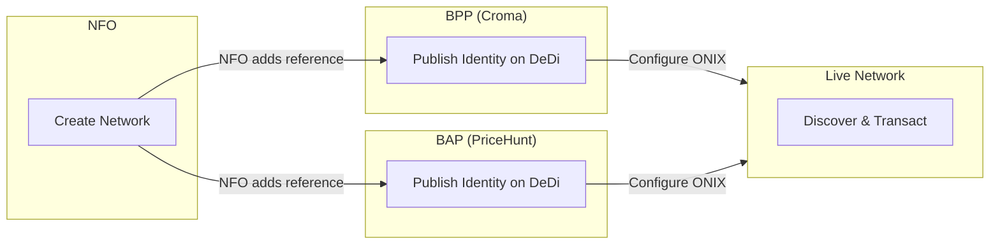
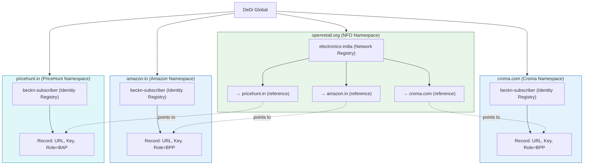

# Electronics Network Onboarding — Flowchart

## Full Onboarding Flow

```mermaid
flowchart TD
    subgraph PHASE1["Phase 1: NFO Creates the Network (One-Time)"]
        A1[NFO creates DeDi Global account] --> A2[Create namespace: openretail.org]
        A2 --> A3[Add TXT record to DNS]
        A3 --> A4{Domain verified?}
        A4 -->|No, wait 15min-48hrs| A3
        A4 -->|Yes| A5[Create registry: electronics-india]
        A5 --> A6[/"network_id = openretail.org/electronics-india"/]
    end

    subgraph PHASE2["Phase 2: BPP Publishes Identity (e.g., Croma)"]
        B1[Croma creates DeDi Global account] --> B2[Create namespace: croma.com]
        B2 --> B3[Add TXT record to DNS]
        B3 --> B4{Domain verified?}
        B4 -->|No, wait| B3
        B4 -->|Yes| B5[Create registry: beckn-subscriber]
        B5 --> B6[Publish subscriber record]
        B6 --> B7["subscriber_id: croma.com
        URL: https://croma.com/bpp/beckn
        Type: BPP
        Signing Public Key: K7xM2pQ9..."]
        B7 --> B8[Note record ID = key_id]
        B8 --> B9["Verify key lookup at
        fabric.nfh.global/registry/croma.com/..."]
        B9 --> B10{Key accessible?}
        B10 -->|No, wait 5-10 min| B9
        B10 -->|Yes| B11[Croma's identity is published]
    end

    subgraph PHASE3["Phase 3: NFO Adds BPP to Network"]
        C1{NFO validates Croma} --> C2[Is it a real business?]
        C1 --> C3[Is callback URL reachable?]
        C1 --> C4[Is public key valid?]
        C1 --> C5[Correct environment?]
        C2 --> C6{All checks pass?}
        C3 --> C6
        C4 --> C6
        C5 --> C6
        C6 -->|No| C7[Reject - ask Croma to fix]
        C6 -->|Yes| C8["Add reference to electronics-india registry:
        subscriber_id: croma.com
        url: DeDi lookup URL
        type: Registry"]
        C8 --> C9[Croma is part of the network]
    end

    subgraph PHASE4["Phase 4: BPP Configures ONIX"]
        D1["Configure ONIX on Croma's server:
        subscriber_id: croma.com
        key_id: rec_5f8a2b
        private_key: secret
        network_id: openretail.org/electronics-india"] --> D2[ONIX handles signing & verification]
        D2 --> D3[Croma can now publish catalogs]
    end

    subgraph PHASE5["Phase 5: BAP Onboards (e.g., PriceHunt)"]
        E1[PriceHunt creates DeDi account] --> E2[Verify domain: pricehunt.in]
        E2 --> E3["Publish subscriber record:
        subscriber_id: pricehunt.in
        URL: https://pricehunt.in/bap/beckn
        Type: BAP
        Signing Public Key: R3mN7kL..."]
        E3 --> E4[Verify key lookup]
        E4 --> E5[NFO validates PriceHunt]
        E5 --> E6["NFO adds reference to
        electronics-india registry"]
        E6 --> E7["Configure ONIX:
        subscriber_id: pricehunt.in
        network_id: openretail.org/electronics-india"]
        E7 --> E8[PriceHunt can now send discover requests]
    end

    subgraph PHASE6["Phase 6: Network is Live"]
        F1[PriceHunt user searches iPhone 16]
        F1 --> F2["PriceHunt ONIX signs discover request"]
        F2 --> F3["Discovr verifies signature
        via DeDi public key lookup"]
        F3 --> F4["Searches catalogs:
        Croma, Amazon, Sangeetha"]
        F4 --> F5["on_discover callback
        to PriceHunt"]
        F5 --> F6["User sees iPhone 16
        from all sellers"]
    end

    A6 --> B1
    B11 --> C1
    C9 --> D1
    D3 --> E1
    E8 --> F1

    style PHASE1 fill:#e8f5e9,stroke:#2e7d32
    style PHASE2 fill:#e3f2fd,stroke:#1565c0
    style PHASE3 fill:#fff3e0,stroke:#e65100
    style PHASE4 fill:#f3e5f5,stroke:#6a1b9a
    style PHASE5 fill:#e0f7fa,stroke:#00838f
    style PHASE6 fill:#fce4ec,stroke:#c62828
```

## Simplified Overview

```mermaid
flowchart LR
    subgraph NFO
        N1[Create Network]
    end

    subgraph BPP["BPP (Croma)"]
        B1[Publish Identity on DeDi]
    end

    subgraph BAP["BAP (PriceHunt)"]
        A1[Publish Identity on DeDi]
    end

    subgraph NETWORK["Live Network"]
        L1[Discover & Transact]
    end

    N1 -->|"NFO adds reference"| B1
    N1 -->|"NFO adds reference"| A1
    B1 -->|"Configure ONIX"| NETWORK
    A1 -->|"Configure ONIX"| NETWORK
```

## Who Creates What on DeDi

```mermaid
flowchart TD
    DEDI["DeDi Global"]

    subgraph NFO_NS["openretail.org (NFO Namespace)"]
        NR["electronics-india (Network Registry)"]
        NR --> REF1["→ croma.com (reference)"]
        NR --> REF2["→ amazon.in (reference)"]
        NR --> REF3["→ pricehunt.in (reference)"]
    end

    subgraph CROMA_NS["croma.com (Croma Namespace)"]
        CR["beckn-subscriber (Identity Registry)"]
        CR --> CREC["Record: URL, Key, Role=BPP"]
    end

    subgraph AMAZON_NS["amazon.in (Amazon Namespace)"]
        AR["beckn-subscriber (Identity Registry)"]
        AR --> AREC["Record: URL, Key, Role=BPP"]
    end

    subgraph PH_NS["pricehunt.in (PriceHunt Namespace)"]
        PR["beckn-subscriber (Identity Registry)"]
        PR --> PREC["Record: URL, Key, Role=BAP"]
    end

    DEDI --> NFO_NS
    DEDI --> CROMA_NS
    DEDI --> AMAZON_NS
    DEDI --> PH_NS

    REF1 -.->|"points to"| CREC
    REF2 -.->|"points to"| AREC
    REF3 -.->|"points to"| PREC

    style NFO_NS fill:#e8f5e9,stroke:#2e7d32
    style CROMA_NS fill:#e3f2fd,stroke:#1565c0
    style AMAZON_NS fill:#e3f2fd,stroke:#1565c0
    style PH_NS fill:#e0f7fa,stroke:#00838f
```
